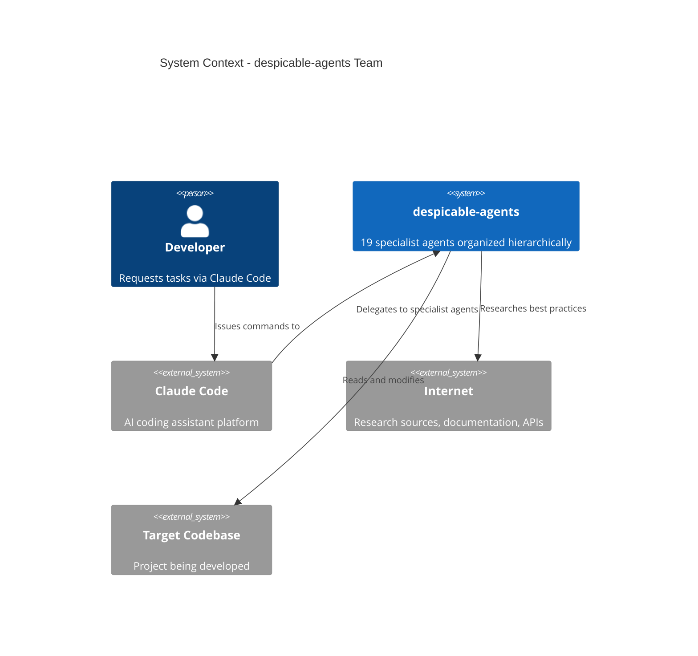
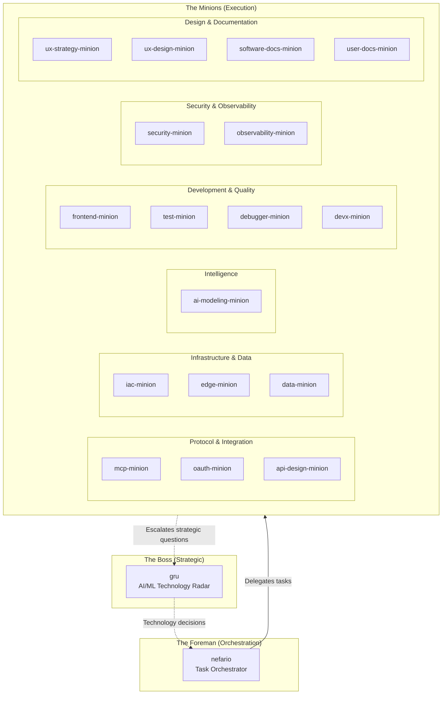
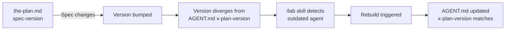
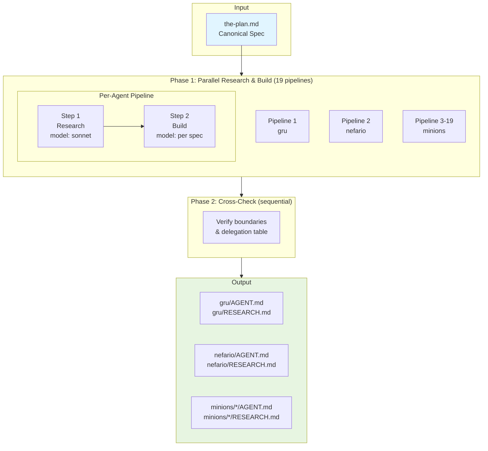
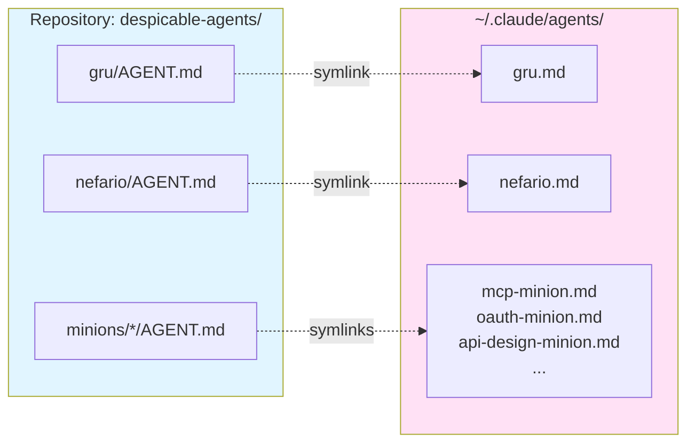
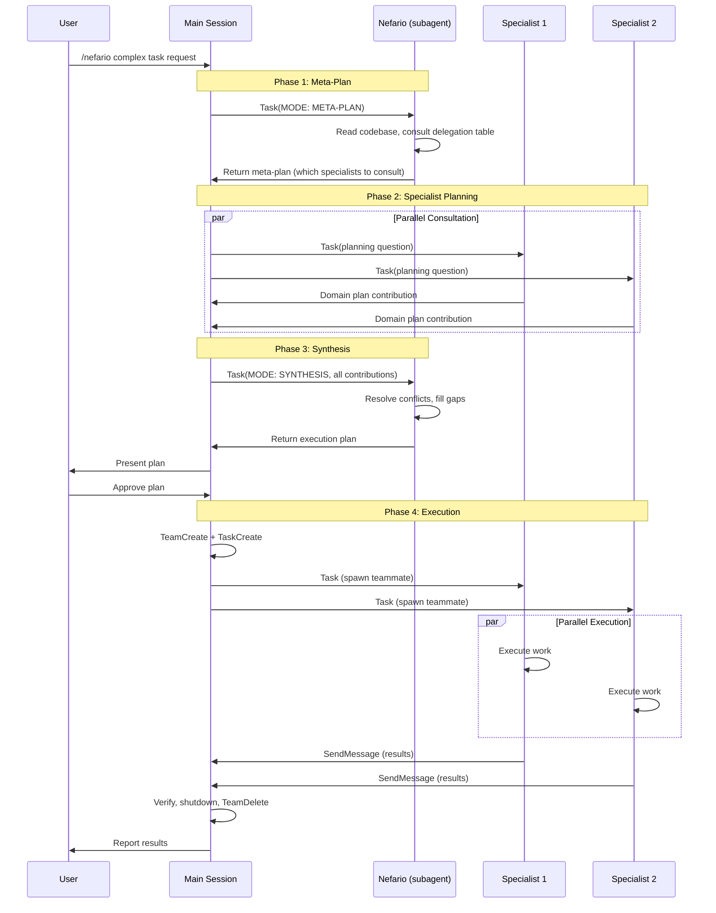

# Architecture Documentation

## System Overview

The despicable-agents project is a specialist agent team for Claude Code consisting of 19 domain-expert agents organized into a three-tier hierarchy. The system implements a delegate-based multi-agent architecture where complex tasks are decomposed and routed to specialists, each with deep expertise in their domain and strict boundaries that prevent overlap.

### Design Philosophy

The architecture is built on four foundational principles:

**Generic Domain Specialists** — Each agent has deep expertise in their domain without being tied to any specific project. Project-specific context belongs in the target project's `CLAUDE.md` file, not in the agents themselves. This makes agents reusable across different projects and teams.

**Publishable** — All agents are designed to be publishable under Apache 2.0 license. No PII, no project-specific data, no proprietary patterns. Every agent can be shared publicly without modification.

**Composable** — Agents can be combined into different teams for different projects. Clear boundaries ensure delegation is unambiguous. The delegation table maps tasks to specialists deterministically.

**Persistent Learners** — Each agent uses `memory: user` to build knowledge across sessions, continuously improving based on experience.

### System Context



## Agent Hierarchy

The system implements a three-tier hierarchy with clear delegation patterns and responsibilities.



### Tier 1: The Boss (gru)

**Domain**: AI/ML technology landscape, strategic technology decisions

**Responsibilities**:
- Technology readiness evaluation (adopt/trial/assess/hold framework)
- Foundation model landscape tracking
- Agent protocol maturity assessment
- AI regulation and compliance horizon scanning
- Build vs. wait vs. watch recommendations
- Hype cycle separation (signal from noise)

**Delegation Pattern**: Gru does not execute. When technology assessment identifies a need to implement, gru hands off to nefario for orchestration or directly to the appropriate specialist minion.

**Model**: opus (strategic reasoning requires highest capability)

### Tier 2: The Foreman (nefario)

**Domain**: Task orchestration, multi-agent coordination

**Responsibilities**:
- Decomposing complex tasks into specialist subtasks
- Routing work to the right minion based on delegation table
- Identifying when multiple minions need to collaborate
- Coordinating handoffs between minions
- Synthesizing results from multiple minions
- Managing the plan-execute-verify cycle
- Resolving conflicts between agents

**Delegation Pattern**: Nefario is invoked via the `/nefario` skill from a normal Claude Code session. The skill spawns nefario as a planning subagent — nefario reads the codebase, consults its delegation table, and returns a structured delegation plan. The calling session then executes the plan by creating an agent team and spawning the recommended specialists.

**Platform Constraint**: Custom agents (`claude --agent`) do not receive the Task tool from the Claude Code runtime (as of v2.1.37). This means nefario cannot spawn specialist agents directly. The `/nefario` skill works around this by keeping the main session (which has the Task tool) as the executor, while nefario provides the planning intelligence. Nefario's AGENT.md includes mode detection — if the Task tool becomes available in future Claude Code versions, nefario automatically switches to direct orchestration.

**Model**: sonnet (coordination reasoning, cost-efficient for planning)

**Key Insight**: The delegation intelligence (delegation table, decomposition principles, cross-cutting concerns) lives in nefario's AGENT.md. The `/nefario` skill is a lightweight bridge that connects this intelligence to the main session's spawning capability. This keeps a single source of truth while working within platform constraints.

### Tier 3: The Minions (17 specialists)

Organized into six domain groups, each minion has:
- **Deep domain expertise** encoded in their system prompt
- **Strict boundaries** defined by "Does NOT do" sections
- **Clear handoff points** to other specialists
- **Backing research** in RESEARCH.md files

**Protocol & Integration Group**:
- `mcp-minion`: MCP server development, tool/resource/prompt design, transports
- `oauth-minion`: OAuth 2.0/2.1 flows, PKCE, token management, MCP auth
- `api-design-minion`: REST/GraphQL API design, versioning, error responses

**Infrastructure & Data Group**:
- `iac-minion`: Terraform, Docker, CI/CD, cloud provisioning
- `edge-minion`: CDN, edge workers, load balancing, caching strategies
- `data-minion`: Database architecture across paradigms (document, vector, graph, SQL, edge)

**Intelligence Group**:
- `ai-modeling-minion`: Prompt engineering, Anthropic API, multi-agent architectures, LLM optimization

**Development & Quality Group**:
- `frontend-minion`: React, TypeScript, component libraries, CSS, build tooling
- `test-minion`: Test strategy, automation, coverage analysis
- `debugger-minion`: Root cause analysis, reverse engineering, profiling
- `devx-minion`: CLI/SDK design, developer onboarding, configuration

**Security & Observability Group**:
- `security-minion`: Application security, threat modeling, OWASP, prompt injection defense
- `observability-minion`: Logging, metrics, tracing, alerting, SLO/SLI design

**Design & Documentation Group**:
- `ux-strategy-minion`: User journey mapping, simplification audits, cognitive load reduction
- `ux-design-minion`: UI/UX design, accessibility, design systems, visual hierarchy
- `software-docs-minion`: Architecture documentation (C4, ADRs), API docs, Mermaid diagrams
- `user-docs-minion`: User guides, tutorials, troubleshooting, in-app help

## Agent Anatomy

Each agent is composed of two files with specific structures and purposes.

### AGENT.md Structure

The deployable agent file consists of YAML frontmatter and a Markdown system prompt body.

#### Frontmatter Schema

```yaml
---
name: <agent-name>
description: >
  <2-4 sentence description. First sentence = what the agent IS.
  Remaining sentences = when to delegate to it. Include "Use proactively"
  where appropriate.>
model: opus | sonnet
memory: user
x-plan-version: "<major>.<minor>"
x-build-date: "YYYY-MM-DD"
---
```

**Field Descriptions**:
- `name`: Agent identifier, matches directory name
- `description`: Used by Claude Code to decide when to delegate to this agent
- `model`: `opus` for strategic/deep reasoning, `sonnet` for execution/cost-efficiency
- `memory`: `user` enables persistent learning across conversations
- `x-plan-version`: Spec version this build is based on (from the-plan.md)
- `x-build-date`: When AGENT.md was last generated

**Optional Fields**:
- `tools`: Restricts available tools (strict allowlist). Omit to grant full access to whatever the runtime provides. Most agents omit this field.

#### System Prompt Structure

The Markdown body follows a five-section template:

**1. Identity** — One paragraph stating who the agent is and their core mission. Sets the agent's perspective and primary goal.

**2. Core Knowledge** — Deep domain expertise organized by topic. This is the densest section, encoding essential knowledge from RESEARCH.md. Uses subsections with descriptive headers.

**3. Working Patterns** — How the agent approaches tasks. What it checks first, decision trees, common workflows. Task-oriented structure answering "when asked to X, do Y."

**4. Output Standards** — What good output looks like for this agent. Format specifications, quality criteria, examples.

**5. Boundaries** — What this agent does NOT do, with explicit delegation targets. Clear handoff triggers to other specialists. Collaboration patterns with supporting agents.

### RESEARCH.md Structure

The research backing file contains comprehensive domain research organized by topic. Not deployed to Claude Code, but serves as the knowledge base from which the system prompt is distilled.

**Content**: Best practices, established patterns, prior art, framework comparisons, tool evaluations, common pitfalls, benchmark data, RFC specifications, API design patterns, industry standards.

**Sources**: Internet research (WebSearch), documentation (WebFetch), past conversation history (mined for generic patterns), open-source agent prompts (for patterns, not copying), domain-specific research listed in the-plan.md spec.

**Organization**: Topic-based sections with citations. Focuses on actionable knowledge, not academic overviews. Pragmatic, production-oriented perspective.

## Versioning System

The project uses a three-field versioning system to track when agents need regeneration.



### Version Fields

| Field | Location | Purpose | Format |
|-------|----------|---------|--------|
| `spec-version` | Agent spec in the-plan.md | Current version of the specification | `<major>.<minor>` |
| `x-plan-version` | AGENT.md frontmatter | Spec version this build was based on | `<major>.<minor>` |
| `x-build-date` | AGENT.md frontmatter | When AGENT.md was last generated | `YYYY-MM-DD` |

### Version Semantics

**Major version bump**: Changes to agent remit, domain boundaries, tools, or fundamental responsibilities. Indicates the agent's role has evolved.

**Minor version bump**: Refinements to knowledge, working patterns, or output standards within existing remit. Improvements without scope changes.

**Divergence detection**: When `x-plan-version` < `spec-version`, the agent is outdated and needs regeneration. The `/lab` skill automates this check.

### Initial Version

All agents start at `1.0`. This establishes a baseline for future tracking.

## Build Pipeline

The system uses a multi-stage build pipeline to generate agents from specifications.



### Phase 1: Research & Build (Parallel)

All 19 agents are built in parallel, each running a two-step sequential pipeline:

#### Step 1: Research (model: sonnet)

**Inputs**: Agent spec from the-plan.md, internet sources, past conversation history

**Process**:
1. Read agent's spec from the-plan.md (domain, remit, research focus areas)
2. Search internet for best practices, established patterns, prior art using WebSearch/WebFetch
3. Search past conversation history at `~/.claude/projects/` for relevant patterns (extract only generic patterns, no PII)
4. If RESEARCH.md exists, preserve still-relevant content and add new findings
5. Write or update RESEARCH.md organized by topic with sources cited

**Output**: `<agent-dir>/RESEARCH.md`

**Model choice**: Sonnet for cost-efficiency in web search and summarization tasks

#### Step 2: Build (model: per agent spec)

**Inputs**: Agent spec from the-plan.md, completed RESEARCH.md

**Process**:
1. Read the-plan.md for agent's frontmatter pattern and system prompt structure
2. Read completed RESEARCH.md
3. Distill RESEARCH.md into dense, actionable system prompt following five-section structure:
   - Identity (one paragraph)
   - Core Knowledge (dense domain expertise)
   - Working Patterns (task-oriented workflows)
   - Output Standards (quality criteria)
   - Boundaries (what NOT to do, handoff points)
4. Write AGENT.md with frontmatter values:
   - `model`: from agent's Model field
   - `x-plan-version`: current spec-version
   - `x-build-date`: today's date

**Output**: `<agent-dir>/AGENT.md`

**Model choice**: Per agent spec. Opus for strategic agents (gru, debugger, ai-modeling, security), sonnet for execution specialists.

**Rationale for per-agent models**: Strategic/reasoning-intensive agents benefit from opus-level capability. Execution-focused agents are cost-optimized with sonnet while maintaining quality.

### Phase 2: Cross-Check (Sequential)

After all 19 pipelines complete, verify:

- **Boundary consistency**: Each piece of work has exactly one primary agent
- **Handoff clarity**: "Does NOT do" sections create clean delegation points
- **Delegation table accuracy**: Table entries match agent remits
- **No overlaps**: No redundant responsibilities between neighboring agents

**Output**: `CROSS-CHECK-REPORT.md` documenting findings and any conflicts requiring resolution

### Build Triggers

**Manual rebuild**: `/lab <agent-name> ...` regenerates specified agents

**Version-based rebuild**: `/lab --check` identifies outdated agents (x-plan-version < spec-version), then `/lab <outdated-agents>` rebuilds them

**Full rebuild**: `/lab --all` force-rebuilds all 19 agents regardless of version

### Build Automation

The `/lab` skill (`.claude/skills/lab/SKILL.md`) encapsulates the build pipeline logic. It:
- Parses arguments to determine which agents to rebuild
- Checks versions to identify outdated agents
- Executes the two-step research and build pipeline per agent
- Runs cross-check verification after all builds complete
- Reports results with version status table

## Deployment Architecture

Agents are deployed to Claude Code via symlinks, making edits immediately live without redeployment.



### Deployment Process

Execute from project root:

```bash
./install.sh           # Install all agents
./install.sh uninstall # Remove all agents
```

The install script creates symlinks from each `AGENT.md` to `~/.claude/agents/<name>.md`, using absolute paths. It is idempotent and safe to run multiple times.

### Deployment Benefits

**Instant updates**: Edits to AGENT.md in the repository are immediately visible to Claude Code (no reinstall or restart required)

**Version control**: All agent files tracked in Git with full history

**Easy rollback**: `git checkout <version>` rolls back all agents to a previous state

**Development workflow**: Edit agents locally, test immediately, commit when stable

**Multi-machine sync**: Same repository can deploy to multiple machines via Git

## Agent Boundaries and Delegation Model

The system enforces strict boundaries to prevent overlap and ensure clear delegation paths.

### Boundary Enforcement Mechanisms

**"Does NOT do" sections**: Every agent's system prompt explicitly lists what it does NOT handle, with delegation targets. These create hard boundaries.

**Delegation table**: Nefario's embedded routing table maps task types to primary and supporting agents deterministically. Eliminates ambiguity in task assignment.

**Handoff triggers**: Specific phrases or request types trigger delegation to named specialists. Example: "Is this secure?" → security-minion.

**File ownership**: No two agents modify the same file. If multiple perspectives are needed, work is sequenced or one agent integrates changes.

### Delegation Flow



### Primary vs. Supporting Agent Roles

**Primary agent**: Owns the deliverable. Performs the core work. Has final decision-making authority for their domain. Example: For REST API design, api-design-minion is primary.

**Supporting agent**: Provides input, reviews from their perspective, handles secondary concerns. Does not own the deliverable. Example: For REST API design, software-docs-minion provides documentation perspective as supporting.

**Collaboration pattern**: Primary agent produces initial work. Supporting agents review and contribute their specialized perspective. Primary agent integrates feedback and delivers final output.

### Cross-Cutting Concerns

Most tasks have secondary dimensions beyond the primary domain. The delegation model mandates considering:

- **Security**: Almost always relevant (security-minion)
- **Documentation**: Developer-facing (software-docs-minion) or user-facing (user-docs-minion)
- **UX**: Developer experience (devx-minion) or end-user experience (ux-strategy/ux-design)
- **Observability**: Production systems need logging/metrics (observability-minion)
- **Testing**: Code changes need test strategy (test-minion)

**Principle**: Include supporting agents rather than skipping them when in doubt. A single agent is appropriate only for pure research or trivial lookups.

### Escalation Paths

**To gru**: When strategic technology decisions are needed (adopt/hold/wait framework), protocol evaluation, or technology radar assessment.

**To nefario**: When a single-agent task grows into multi-domain complexity requiring coordination.

**To user**: When priorities are unclear, requirements are ambiguous, or major risks are identified.

## Design Decisions and Tradeoffs

### Decision 1: Three-Tier Hierarchy vs. Flat Structure

**Decision**: Implement three-tier hierarchy (Boss → Foreman → Minions) rather than flat peer structure.

**Rationale**:
- Complex tasks need orchestration layer (nefario) to decompose and coordinate
- Strategic technology decisions need different perspective than execution (gru)
- Flat structure creates ambiguity about who coordinates multi-agent tasks

**Tradeoff**: Additional complexity in delegation flow, but gains deterministic task routing and clear separation of concerns.

**Alternative considered**: Flat structure where Claude Code directly delegates to any specialist. Rejected because coordination logic would be duplicated across multiple agents.

### Decision 2: Strict Boundaries vs. Overlapping Capabilities

**Decision**: Enforce strict, non-overlapping boundaries with explicit "Does NOT do" sections.

**Rationale**:
- Eliminates ambiguity in task routing
- Prevents multiple agents attempting the same work
- Makes delegation table deterministic
- Reduces context window waste (no redundant knowledge across agents)

**Tradeoff**: Requires more precise task decomposition and more handoffs, but eliminates conflicts and ensures expert execution.

**Alternative considered**: Allow overlapping capabilities for flexibility. Rejected because it leads to inconsistent delegation and coordination overhead.

### Decision 3: RESEARCH.md + AGENT.md vs. Single File

**Decision**: Separate research backing (RESEARCH.md) from deployable agent (AGENT.md).

**Rationale**:
- RESEARCH.md can be comprehensive without bloating the system prompt
- System prompt (AGENT.md) stays dense and actionable
- Research is reusable for future refinements without re-searching
- Separation clarifies what is deployed vs. what is reference material

**Tradeoff**: Two files to maintain per agent, but system prompts remain focused and Claude Code context usage is optimized.

**Alternative considered**: Single file with all research. Rejected because system prompts would exceed optimal size and include noise.

### Decision 4: Sonnet for Research, Per-Spec for Build

**Decision**: Use sonnet for research step, agent-specific model (opus or sonnet) for build step.

**Rationale**:
- Research is web search + summarization, not deep reasoning (sonnet sufficient)
- Build step quality directly impacts agent effectiveness (warrant opus for strategic agents)
- Cost optimization for the expensive research phase (19 parallel web searches)

**Tradeoff**: Two-step pipeline per agent, but cost-effective without sacrificing build quality.

**Alternative considered**: Opus for all steps. Rejected due to cost. Sonnet for all steps. Rejected because strategic agent quality suffered.

### Decision 5: User-Scope Memory vs. Project-Scope

**Decision**: Use `memory: user` for all agents rather than project-scoped memory.

**Rationale**:
- Domain expertise is reusable across projects
- Agents learn patterns that apply broadly
- Project-specific context belongs in project's CLAUDE.md, not agent memory

**Tradeoff**: Agents cannot retain project-specific details, but remain generic and publishable.

**Alternative considered**: Project-scope memory. Rejected because it couples agents to specific projects, violating the "generic domain specialists" principle.

### Decision 6: Delegation Table in Nefario vs. Per-Agent Routing Logic

**Decision**: Centralize task-to-agent mapping in nefario's delegation table rather than distributing routing logic across agents.

**Rationale**:
- Single source of truth for task routing
- Easier to maintain and update routing rules
- Prevents inconsistent routing decisions
- Enables nefario to identify gaps (tasks with no primary agent)

**Tradeoff**: Nefario's system prompt is larger, but routing is deterministic and maintainable.

**Alternative considered**: Each agent knows how to route related tasks. Rejected because it creates circular delegation risks and inconsistent routing.

### Decision 7: Symlink Deployment vs. Copy

**Decision**: Deploy agents to `~/.claude/agents/` via symlinks rather than copying files.

**Rationale**:
- Edits are immediately live without redeployment
- Single source of truth in repository
- Version control tracks all changes
- Easy rollback to previous versions

**Tradeoff**: Requires repository to remain in place (can't delete it), but development workflow is dramatically improved.

**Alternative considered**: Copy AGENT.md files to `~/.claude/agents/`. Rejected because it requires manual re-copy after every edit.

### Decision 8: Versioning Triggers Rebuild vs. Rebuild on Every Commit

**Decision**: Use spec-version to trigger rebuilds only when specs change, not on every commit.

**Rationale**:
- Most commits don't change agent specs (documentation, tooling, etc.)
- Rebuilds are expensive (19 parallel research + build pipelines)
- Version divergence is the signal that an agent is outdated

**Tradeoff**: Manual version bumps required, but avoids unnecessary rebuild churn.

**Alternative considered**: Rebuild on every commit to the-plan.md. Rejected due to cost and unnecessary work.

## Future Considerations

**Agent Discovery**: Currently agents are manually deployed via symlinks. Future enhancement: automatic discovery and installation from the repository.

**Agent Marketplace**: With strict boundaries and publishable design, agents could be distributed individually or as curated sets for specific use cases.

**Telemetry**: Track which agents are most frequently delegated to, delegation paths, and success rates. Use data to refine boundaries and delegation table.

**Automated Cross-Checks**: Currently Phase 2 cross-check is manual. Could be automated with boundary consistency rules and delegation table validation.

**Agent Versioning at Runtime**: Claude Code could select agent versions based on task requirements (use older stable version vs. latest experimental).

**Inter-Agent Protocols**: Currently agents communicate through nefario. Direct agent-to-agent communication could reduce coordination overhead for tightly coupled tasks.

**Performance Optimization**: Profile which agents benefit most from opus vs. sonnet. Potentially introduce haiku for simple execution tasks.

**Boundary Evolution**: As new domains emerge (quantum computing, AR/VR, blockchain), new minions can be added without restructuring existing agents.

---

## Quick Reference

### Agent Groups

| Group | Agents | Focus |
|-------|--------|-------|
| **Boss** | gru | Strategic technology decisions |
| **Foreman** | nefario | Multi-agent coordination |
| **Protocol & Integration** | mcp-minion, oauth-minion, api-design-minion | How systems communicate |
| **Infrastructure & Data** | iac-minion, edge-minion, data-minion | Where things run, where data lives |
| **Intelligence** | ai-modeling-minion | AI/LLM integration |
| **Development & Quality** | frontend-minion, test-minion, debugger-minion, devx-minion | Building and verifying code |
| **Security & Observability** | security-minion, observability-minion | Keeping systems safe and visible |
| **Design & Documentation** | ux-strategy-minion, ux-design-minion, software-docs-minion, user-docs-minion | How things look and are explained |

### Common Workflows

**Rebuild outdated agents**:
```bash
# Check which agents are outdated
/lab --check

# Rebuild specific agents
/lab mcp-minion oauth-minion

# Force rebuild all
/lab --all
```

**Deploy agents**:
```bash
./install.sh           # Install all agents
./install.sh uninstall # Remove all agents
```

**Update agent spec**:
1. Edit the-plan.md (update spec content)
2. Bump spec-version (major for remit changes, minor for refinements)
3. Run `/lab <agent-name>` to regenerate
4. Changes are immediately live (symlinked deployment)

### Key Files

| File | Purpose |
|------|---------|
| `the-plan.md` | Canonical spec for all agents (source of truth, human-edited) |
| `gru/AGENT.md` | Deployable agent file for gru (YAML frontmatter + system prompt) |
| `gru/RESEARCH.md` | Research backing for gru's knowledge |
| `nefario/AGENT.md` | Deployable orchestrator agent |
| `minions/*/AGENT.md` | Deployable specialist agents (17 total) |
| `minions/*/RESEARCH.md` | Research backing for each specialist |
| `.claude/skills/lab/SKILL.md` | Build pipeline automation skill |
| `~/.claude/skills/nefario/SKILL.md` | Nefario orchestration skill (bridges planning intelligence to execution) |

### Architecture Patterns

**Task Delegation**: User → `/nefario` skill → four-phase planning (meta-plan → specialist consultation → synthesis) → main session spawns specialist teammates

**Four-Phase Planning**: Nefario's cycle: (1) Meta-plan (identify which specialists to consult) → (2) Specialist planning (domain experts contribute) → (3) Synthesis (consolidate into execution plan) → (4) Execute and verify

**Boundary Enforcement**: "Does NOT do" sections + delegation table + handoff triggers

**Version Tracking**: spec-version (the-plan.md) ↔ x-plan-version (AGENT.md frontmatter)

**Build Pipeline**: Research (sonnet) → Build (per-spec model) → Cross-check

**Deployment**: Symlinks from repository to `~/.claude/agents/` (edits immediately live)
