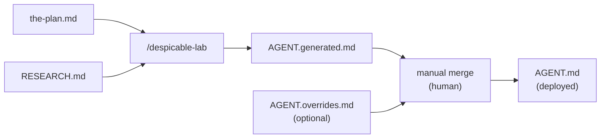

# Agent Anatomy and Overlay System

[< Back to Architecture Overview](architecture.md)

Each agent in despicable-agents consists of two primary files: a deployable agent file (`AGENT.md`) and a research backing file (`RESEARCH.md`). Agents that require hand-tuned customizations use an overlay mechanism that adds two intermediate files to the build process.

## AGENT.md Structure

The deployable agent file has two parts: YAML frontmatter and a Markdown system prompt body.

### Frontmatter Schema

```yaml
---
name: <agent-name>
description: >
  <2-4 sentence description. First sentence = what the agent IS.
  Remaining sentences = when to delegate to it. Include "Use proactively"
  where appropriate.>
model: opus | sonnet
memory: user
x-plan-version: "<major>.<minor>"
x-build-date: "YYYY-MM-DD"
---
```

| Field | Required | Purpose |
|-------|----------|---------|
| `name` | yes | Agent identifier, matches directory name |
| `description` | yes | Used by Claude Code to decide when to delegate to this agent |
| `model` | yes | `opus` for strategic/deep reasoning, `sonnet` for execution/cost-efficiency |
| `memory` | yes | Always `user` -- enables persistent learning across conversations |
| `x-plan-version` | yes | Spec version this build is based on (from `the-plan.md`) |
| `x-build-date` | yes | Date this AGENT.md was last generated |
| `tools` | no | Restricts available tools (strict allowlist). Omit to grant full access. Most agents omit this field |
| `x-fine-tuned` | no | Present and `true` when overlay customizations exist. Auto-injected during merge, never set manually |

### System Prompt Structure

The Markdown body below the frontmatter follows a five-section template.

**Identity** -- One paragraph stating who the agent is and their core mission. Sets the agent's perspective and primary goal.

**Core Knowledge** -- Deep domain expertise organized by topic. The densest section, encoding essential knowledge distilled from RESEARCH.md. Uses subsections with descriptive headers.

**Working Patterns** -- How the agent approaches tasks. Decision trees, common workflows, task-oriented structure answering "when asked to X, do Y."

**Output Standards** -- What good output looks like for this agent. Format specifications, quality criteria, structural expectations.

**Boundaries** -- What this agent does NOT do, with explicit delegation targets. Clear handoff triggers to other specialists. Collaboration patterns with supporting agents.

The five sections appear in order. Some agents add domain-specific sections between Identity and Core Knowledge (for example, nefario has an "Invocation Modes" section), but the five listed above are the universal scaffold.

## RESEARCH.md Structure

The research backing file contains comprehensive domain research organized by topic. It is not deployed to Claude Code -- it serves as the knowledge base from which the system prompt is distilled.

**Content**: Best practices, established patterns, prior art, framework comparisons, tool evaluations, common pitfalls, benchmark data, RFC specifications, API design patterns, industry standards. The focus is actionable knowledge, not academic overviews.

**Sources**: Internet research (WebSearch/WebFetch), official documentation, past conversation history mined for generic patterns, open-source agent prompts examined for structural patterns, and domain-specific research areas listed in `the-plan.md`.

**Organization**: Topic-based sections with citations. Pragmatic, production-oriented perspective. The goal is to provide enough depth that the Build step can distill a dense, accurate system prompt without inventing information.

## Overlay Mechanism

### Problem

The `/despicable-lab` build pipeline generates `AGENT.md` from `the-plan.md` + `RESEARCH.md`. This generation is one-directional: any hand-tuned customization in `AGENT.md` is lost on the next rebuild.

Without a preservation mechanism, maintainers face a forced choice:

1. **Edit `the-plan.md`** to encode prompt-level adjustments into the spec. This pollutes the spec's purpose -- it is a high-level description, not a prompt-engineering surface.
2. **Edit `AGENT.md` directly** and accept that the next rebuild destroys the changes.
3. **Do nothing** and live with generated output that could be better.

The overlay mechanism solves this by separating generated output from hand-tuned customizations.

### Three-File Pattern

Agents that need customization use three files in their directory:

```
nefario/
  AGENT.generated.md    # output of /despicable-lab (never hand-edited)
  AGENT.overrides.md    # hand-tuned customizations (optional, human-edited)
  AGENT.md              # merged result (deployed, never hand-edited directly)
  RESEARCH.md
```

- **AGENT.generated.md** -- Pure output of the `/despicable-lab` pipeline. Always regenerated from `the-plan.md` + `RESEARCH.md`. Never hand-edited.
- **AGENT.overrides.md** -- Optional file containing hand-tuned customizations. Only exists for agents that need fine-tuning. Human-edited, never touched by `/despicable-lab`.
- **AGENT.md** -- The merged result of generated + overrides. This is what gets symlinked to `~/.claude/agents/`. Never hand-edited directly.

Most agents (those without customizations) have only `AGENT.generated.md` and `AGENT.md` with identical content. The third file appears only when customization is needed.

### Build Flow



When no `AGENT.overrides.md` exists, `/despicable-lab` directly writes `AGENT.md` unchanged. When `AGENT.overrides.md` exists, `/despicable-lab` writes `AGENT.generated.md` and stops -- the human user must manually merge generated + overrides → deployed following the merge rules below.

### Merge Rules

The merge operates on two layers: YAML frontmatter and Markdown body.

**YAML frontmatter** -- Shallow merge. Keys from `AGENT.overrides.md` frontmatter replace matching keys in `AGENT.generated.md` frontmatter. Non-overlapping keys from both files are preserved. Override keys always win. The flag `x-fine-tuned: true` is automatically injected into the merged frontmatter whenever an overrides file exists.

```yaml
# AGENT.generated.md frontmatter
---
name: nefario
description: >
  Generated description.
model: sonnet
x-plan-version: "1.2"
x-build-date: "2026-02-09"
---

# AGENT.overrides.md frontmatter
---
x-plan-version: "1.3"
---

# Merged AGENT.md frontmatter
---
name: nefario
description: >
  Generated description.
model: sonnet
x-plan-version: "1.3"
x-build-date: "2026-02-09"
x-fine-tuned: true
---
```

**Markdown body** -- Section-level replacement by H2 heading match. Each `## Heading` in the overrides file replaces the entire corresponding section in the generated file. A section is everything from its `## Heading` to the next `## Heading` (or end of file).

A section is either fully generated or fully overridden. There is no partial merge, no append, no prepend. If you need to change one paragraph in a section, you override the entire section.

```markdown
# AGENT.overrides.md body

## Cross-Cutting Concerns (Mandatory Checklist)

Every plan MUST evaluate these six dimensions...
(full replacement of this section)
```

This replaces the entire `## Cross-Cutting Concerns (Mandatory Checklist)` section in the generated output, leaving all other sections untouched.

Heading matching is exact string comparison. If a heading in the overrides file does not match any heading in the generated file, the merge treats it as an orphaned override and emits a warning.

### Version Tracking

- `x-plan-version` in `AGENT.generated.md` reflects the spec version the generation was based on. This is the version `/despicable-lab --check` compares against `spec-version` in `the-plan.md`.
- `AGENT.md` always reflects the latest merge result. Its `x-plan-version` may differ from `AGENT.generated.md` if the overrides file sets it explicitly.
- `x-fine-tuned: true` appears in `AGENT.md` frontmatter whenever overrides are present. This flag is never set in `AGENT.generated.md` or `AGENT.overrides.md` -- it is injected during merge.

### Merging Process

**The merge is currently a manual process**. When `/despicable-lab` regenerates an agent with overrides:

1. `/despicable-lab` writes `AGENT.generated.md` (never touches `AGENT.overrides.md`)
2. `/despicable-lab` reports: "Manual merge required. See docs/agent-anatomy.md for merge rules."
3. Human user manually merges `AGENT.generated.md` + `AGENT.overrides.md` → `AGENT.md` following the merge rules above
4. Human user updates `x-fine-tuned: true` in the merged `AGENT.md` frontmatter

**Why manual?** Automated merging would require LLM-based semantic understanding of override descriptions (see docs/decisions.md Decision 16). Manual merging keeps the process deterministic and preserves human intent.

### Drift Detection

The `validate-overlays.sh` script detects drift in the overlay system. Run it to check for:

- **Orphan overrides**: Sections claimed in `AGENT.overrides.md` that no longer exist in `AGENT.generated.md` (e.g., heading was renamed or removed from spec)
- **Merge staleness**: `AGENT.md` does not reflect the current expected merge of generated + overrides
- **Frontmatter inconsistency**: Merged frontmatter has incorrect key values or missing `x-fine-tuned` flag
- **Configuration mismatches**: Agent has overrides file but no `x-fine-tuned` flag, or vice versa

Usage:

```bash
# Check all agents, show summary + details
./validate-overlays.sh

# Check one agent
./validate-overlays.sh nefario

# Machine-friendly summary (for /despicable-lab integration)
./validate-overlays.sh --summary
```

Example output:

```
AGENT                STATUS     ISSUES
-----------------------------------------
gru                  CLEAN      0
nefario              DRIFT      4
ai-modeling-minion   CLEAN      0
[...]
-----------------------------------------
TOTAL: 19 agents, 1 with drift

=== nefario ===

ORPHAN_OVERRIDE: Section claimed in overrides does not exist in generated
File: nefario/AGENT.overrides.md
Section: ## Working Patterns
Action: Review AGENT.overrides.md and remove or rename the orphaned section claim.

[... more issues ...]
---
```

The script returns:
- Exit code `0` if all agents are clean
- Exit code `1` if drift is detected
- Exit code `2` on script error

**Integration**: `/despicable-lab --check` automatically runs `validate-overlays.sh --summary` and reports drift alongside version mismatches.

**Requirements**: The script requires bash 4.0+ (macOS ships with bash 3.2). Install via Homebrew: `brew install bash`

### Real-World Example: Nefario Overrides

The nefario agent is the first agent to use the overlay mechanism. Its `AGENT.overrides.md` documents the following customizations beyond what `/despicable-lab` generates from the spec:

- **Frontmatter**: Sets `x-plan-version` ahead of the generated value
- **Approval Gates section**: Adds the full decision brief template, response handling rules (approve/request changes/reject/skip), anti-fatigue mechanisms (gate budget, confidence indicators, calibration checks), cascading gate ordering, and gate-vs-notification distinction
- **Architecture Review section**: Adds rationale column to reviewer triggering rules, detailed verdict format templates (APPROVE/ADVISE/BLOCK), and an ARCHITECTURE.md generation template
- **Post-Execution Phases section**: Adds Code Review, Test Execution, Deployment, and Documentation phase details (verdict routing, dark kitchen rules, conditional triggers)
- **Conflict Resolution section**: Expands a single paragraph into three named patterns (resource contention, goal misalignment, hierarchical authority)
- **Output Standards section**: Adds a Final Deliverables subsection for presenting completed work

### Which File to Edit

```
Want to change all agents systematically?
  --> Edit the-plan.md, bump spec-version, rebuild with /despicable-lab

Want to customize one specific agent?
  --> Create or edit AGENT.overrides.md in that agent's directory

Never edit AGENT.md directly
  --> It is a build artifact, overwritten on every merge

Never edit AGENT.generated.md
  --> It is a build artifact, overwritten on every /despicable-lab run
```
