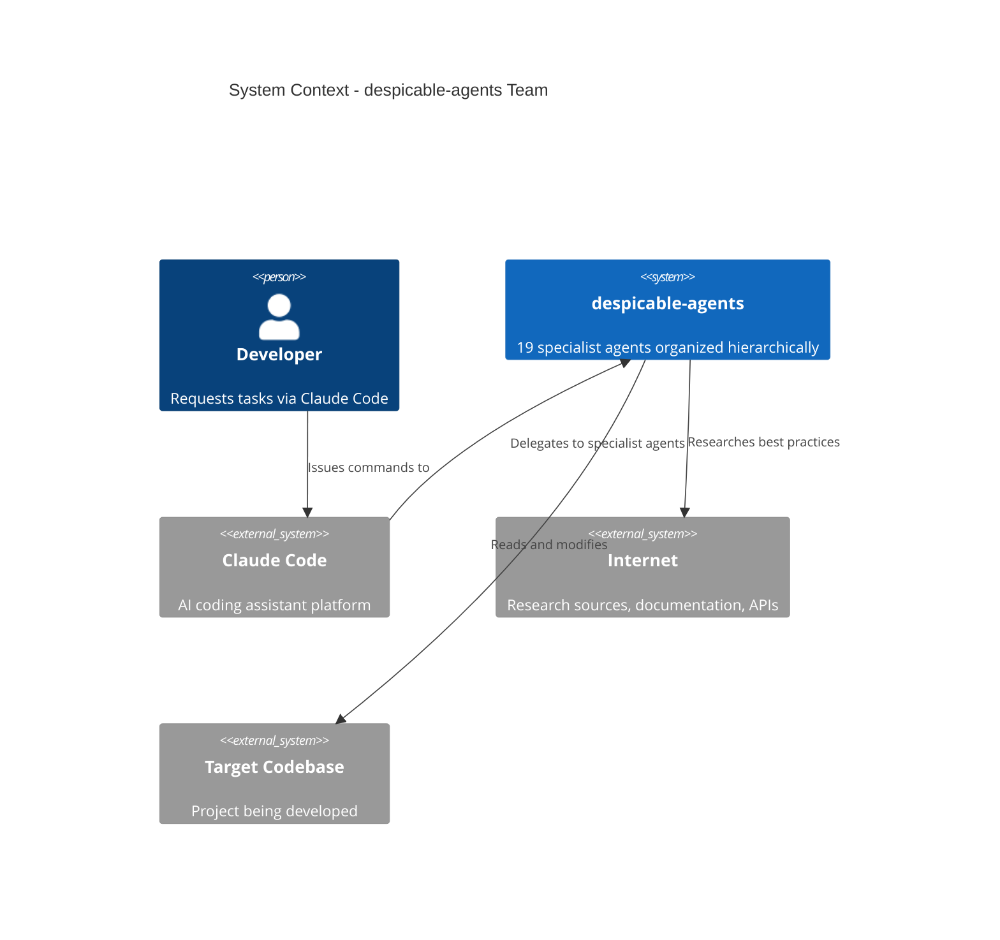
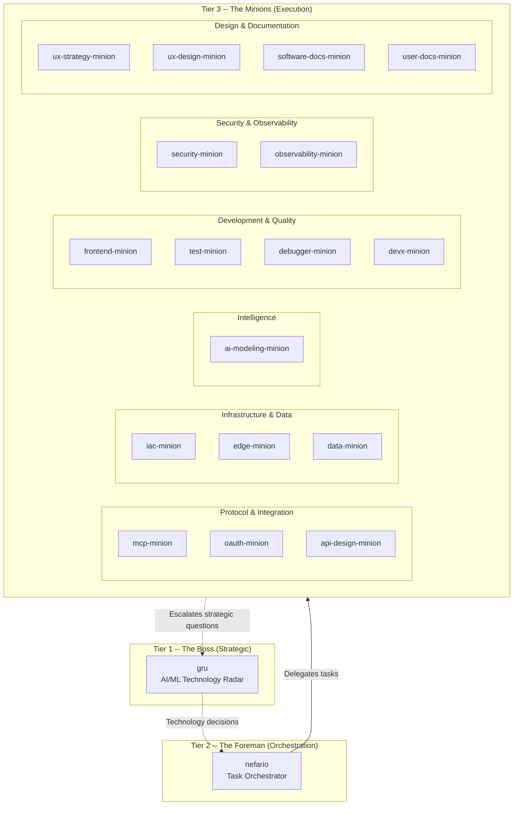

# Architecture Overview

despicable-agents is a specialist agent team for Claude Code: 19 domain-expert agents organized into a three-tier hierarchy. Complex tasks are decomposed and routed to specialists, each with deep expertise in a single domain and strict boundaries that prevent overlap.

## Design Philosophy

Four principles shape every agent:

- **Generic specialists** -- Deep domain expertise without ties to any specific project. Project context belongs in the target project's `CLAUDE.md`, not in agents.
- **Publishable** -- All agents ship under Apache 2.0. No PII, no proprietary data.
- **Composable** -- Clear boundaries and a deterministic delegation table allow agents to be combined into teams for any project.
- **Persistent learners** -- Each agent uses `memory: user` to accumulate knowledge across sessions.

## System Context

## Three-Tier Hierarchy

**Tier 1 (Boss)** -- `gru` evaluates technologies (adopt/trial/assess/hold), tracks the AI landscape, and makes strategic recommendations. Does not execute; hands off to nefario or specialists.

**Tier 2 (Foreman)** -- `nefario` decomposes tasks, routes work via the delegation table, coordinates handoffs, and synthesizes results. Runs a five-phase planning process (meta-plan, specialist consultation, synthesis, architecture review, execution).

**Tier 3 (Minions)** -- 17 specialists grouped by domain. Each has deep expertise encoded in its system prompt, strict "Does NOT do" boundaries, and clear handoff points.

## Agent Groups

| Group | Agents | Focus |
|-------|--------|-------|
| **Boss** | gru | Strategic technology decisions |
| **Foreman** | nefario | Multi-agent coordination |
| **Protocol & Integration** | mcp-minion, oauth-minion, api-design-minion | How systems communicate |
| **Infrastructure & Data** | iac-minion, edge-minion, data-minion | Where things run, where data lives |
| **Intelligence** | ai-modeling-minion | AI/LLM integration |
| **Development & Quality** | frontend-minion, test-minion, debugger-minion, devx-minion | Building and verifying code |
| **Security & Observability** | security-minion, observability-minion | Keeping systems safe and visible |
| **Design & Documentation** | ux-strategy-minion, ux-design-minion, software-docs-minion, user-docs-minion | How things look and are explained |

## Cross-Cutting Concerns

Most tasks have secondary dimensions beyond the primary domain. Nefario's planning process mandates considering six dimensions:

1. **Testing** (test-minion) -- code, config, or infrastructure changes need test strategy
2. **Security** (security-minion) -- attack surface, auth, user input, secrets, dependencies
3. **Usability -- Strategy** (ux-strategy-minion) -- journey coherence, cognitive load, simplification
4. **Usability -- Design** (ux-design-minion) -- accessibility, visual hierarchy, interaction patterns (when UI is involved)
5. **Documentation** (software-docs-minion / user-docs-minion) -- architecture/API changes and user-facing features
6. **Observability** (observability-minion) -- logging, metrics, tracing for production services

## Sub-Documents

| Document | Covers |
|----------|--------|
| [Agent Anatomy and Overlay System](agent-anatomy.md) | AGENT.md structure, frontmatter schema, five-section prompt template, RESEARCH.md role, overlay files |
| [Orchestration and Delegation](orchestration.md) | Five-phase planning process, delegation flow, boundary enforcement, escalation paths, execution reports, automatic report generation, commit points in execution flow |
| [Build Pipeline and Versioning](build-pipeline.md) | Research and build phases, version tracking, `/lab` skill, cross-check verification |
| [Deployment](deployment.md) | Symlink-based deployment, `install.sh`, hook deployment, development workflow |
| [Design Decisions](decisions.md) | Architectural tradeoffs: hierarchy vs. flat, strict boundaries, two-file agents, model selection, memory scope, versioning strategy, reporting automation, git workflow integration |
| [Commit Workflow](commit-workflow.md) | Branching strategy, commit checkpoint format, trigger points, anti-fatigue rules, file change tracking, hook composition, safety rails |
| [Commit Workflow Security](commit-workflow-security.md) | Input validation, safe filename parsing, commit message safety, git command safety for hooks, fail-closed behavior |
