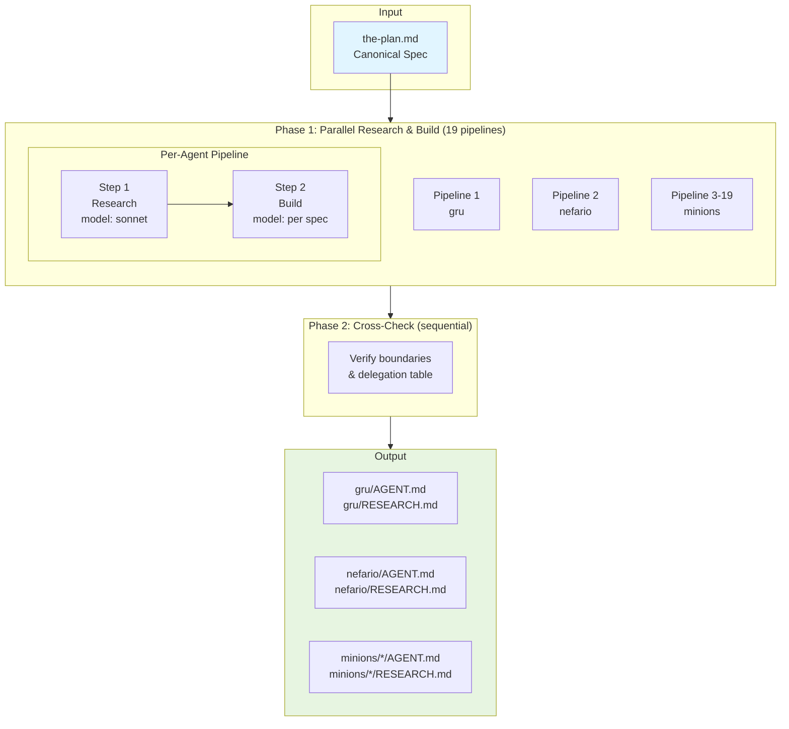
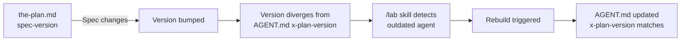

[< Back to Architecture Overview](architecture.md)

# Build Pipeline and Versioning

The build pipeline transforms the canonical specification (`the-plan.md`) into deployable agent files (`AGENT.md`). It runs in two phases: a parallel research-and-build phase for each agent, followed by a sequential cross-check that validates boundary consistency across the full team.

## Pipeline Overview

`the-plan.md` is the single source of truth for all 19 agents. It defines each agent's domain, remit, boundaries, model, and research focus areas. No agent file is hand-authored from scratch -- every `AGENT.md` traces back to a spec entry in `the-plan.md` plus domain research.

The pipeline has two phases:

## Phase 1: Research and Build (Parallel)

All 19 agents are built in parallel. Each agent runs a two-step sequential pipeline.

### Step 1: Research (model: sonnet)

**Inputs**: Agent spec from `the-plan.md`, internet sources, past conversation history.

**Process**:

1. Read the agent's spec from `the-plan.md` (domain, remit, research focus areas).
2. Search the internet for best practices, established patterns, and prior art using WebSearch and WebFetch. Focus on the areas listed in the spec's "Research focus" section.
3. Search past conversation history at `~/.claude/projects/` for relevant patterns. Extract only generic patterns -- no PII or project-specific data.
4. If `RESEARCH.md` already exists, preserve still-relevant content and add new findings.
5. Write or update `RESEARCH.md` in the agent's directory, organized by topic with sources cited.

**Output**: `<agent-dir>/RESEARCH.md`

**Model choice**: Sonnet. Research is web search and summarization, not deep reasoning. Cost-efficient at scale (19 parallel searches).

### Step 2: Build (model: per agent spec)

**Inputs**: Agent spec from `the-plan.md`, completed `RESEARCH.md`.

**Process**:

1. Read `the-plan.md` for the agent's frontmatter pattern and system prompt structure.
2. Read the completed `RESEARCH.md`.
3. Distill `RESEARCH.md` into a dense, actionable system prompt following the five-section structure (Identity, Core Knowledge, Working Patterns, Output Standards, Boundaries).
4. Write `AGENT.generated.md` with frontmatter values:
   - `model`: from the agent's Model field in the spec
   - `x-plan-version`: current `spec-version` from `the-plan.md`
   - `x-build-date`: today's date

**Output**: `<agent-dir>/AGENT.generated.md`

**Model choice**: Per agent spec. Opus for strategic/reasoning-intensive agents (gru, debugger, ai-modeling, security). Sonnet for execution-focused specialists. Build quality directly impacts agent effectiveness, so strategic agents warrant the higher-capability model.

## Merge Step

After the build step produces `AGENT.generated.md`, a merge step produces the deployable `AGENT.md`.

- **Without overrides**: If `AGENT.overrides.md` does not exist, `/lab` writes `AGENT.md` directly from the generated content.
- **With overrides**: If `AGENT.overrides.md` exists, `/lab` writes `AGENT.generated.md` and **stops**. The human user must manually merge `AGENT.generated.md` + `AGENT.overrides.md` → `AGENT.md` following the merge rules documented in [Agent Anatomy and Overlay System](agent-anatomy.md).

**Why manual?** Automated merging would require LLM-based semantic understanding of override descriptions (see docs/decisions.md Decision 16). Manual merging keeps the process deterministic and preserves human intent.

**Drift detection**: Run `./validate-overlays.sh` to check if merged agents have drifted from their expected merge state (orphaned overrides, stale merges, frontmatter inconsistencies).

## Phase 2: Cross-Check (Sequential)

After all 19 pipelines complete and merge steps finish, the cross-check verifies consistency across the full agent team:

- **Boundary consistency**: Each piece of work has exactly one primary agent.
- **Handoff clarity**: "Does NOT do" sections create clean delegation points between neighboring agents.
- **Delegation table accuracy**: Table entries in `the-plan.md` match the remits encoded in built agents.
- **No overlaps**: No redundant responsibilities between agents.

**Output**: `CROSS-CHECK-REPORT.md` documenting findings and any conflicts requiring resolution.

## Versioning System

The project uses three fields to track when agents need regeneration.

### Version Fields

| Field | Location | Purpose | Format |
|-------|----------|---------|--------|
| `spec-version` | Agent spec in `the-plan.md` | Current version of the specification | `<major>.<minor>` |
| `x-plan-version` | `AGENT.md` frontmatter | Spec version this build was based on | `<major>.<minor>` |
| `x-build-date` | `AGENT.md` frontmatter | When `AGENT.md` was last generated | `YYYY-MM-DD` |

### Version Semantics

**Major version bump** (e.g., 1.0 to 2.0): Changes to the agent's remit, domain boundaries, tools, or fundamental responsibilities. The agent's role has evolved.

**Minor version bump** (e.g., 1.0 to 1.1): Refinements to knowledge, working patterns, or output standards within the existing remit. Improvements without scope changes.

All agents start at version `1.0`.

### Divergence Detection

When `x-plan-version` in `AGENT.generated.md` is less than `spec-version` in `the-plan.md`, the agent is outdated and needs regeneration. The `/lab` skill automates this check.

For agents with overlay files, the version check reads `x-plan-version` from `AGENT.generated.md` (not `AGENT.md`), since the generated file reflects the true generation state. If `AGENT.generated.md` does not exist (pre-migration agents), the check falls back to reading `AGENT.md`.

## Build Triggers

The `/lab` skill supports three invocation modes:

| Command | Behavior |
|---------|----------|
| `/lab --check` | Check all agents for version divergence and overlay drift. Reports a table of agent name, current version, spec version, and status. Runs `./validate-overlays.sh --summary` to detect drift. Does not rebuild. |
| `/lab <agent-name> ...` | Regenerate the named agents, even if already up-to-date. Accepts one or more agent names. For agents with overrides, writes `AGENT.generated.md` and reports "Manual merge required". |
| `/lab --all` | Force-rebuild all 19 agents regardless of version status. |

### Typical Workflow

1. Edit `the-plan.md` (update spec content for one or more agents).
2. Bump `spec-version` (major for remit changes, minor for refinements).
3. Run `/lab --check` to confirm which agents are outdated.
4. Run `/lab <agent-name>` to regenerate the outdated agents.
5. Changes are immediately live (agents are deployed via symlinks).

## The /lab Skill

The build pipeline is automated by the `/lab` skill, defined in `.claude/skills/lab/SKILL.md`. This is a project-local skill (lives inside the repository, not deployed to `~/.claude/skills/`).

The skill:

- Parses arguments to determine which agents to rebuild.
- Checks versions by comparing `x-plan-version` against `spec-version` for each agent.
- Runs `./validate-overlays.sh --summary` during `--check` mode to detect overlay drift.
- Executes the two-step research-and-build pipeline per agent, running pipelines in parallel when multiple agents need rebuilding.
- For agents without overrides, writes `AGENT.md` directly. For agents with overrides, writes `AGENT.generated.md` and reports "Manual merge required".
- Runs cross-check verification after all builds complete.
- Reports results with a version status table and summary of changes.

### Constraints

The `/lab` skill enforces several rules:

- It never modifies `the-plan.md` (source of truth, human-edited only).
- It does not regenerate agents that are already up-to-date unless explicitly asked or `--all` is used.
- It preserves existing `RESEARCH.md` content where still relevant.
- All output is in English with no PII or project-specific data.
