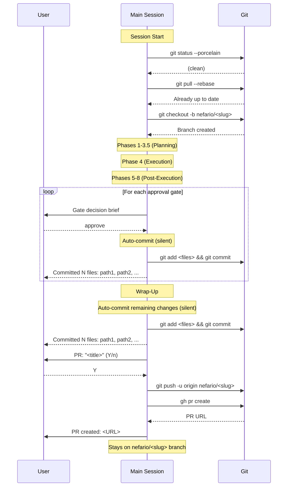
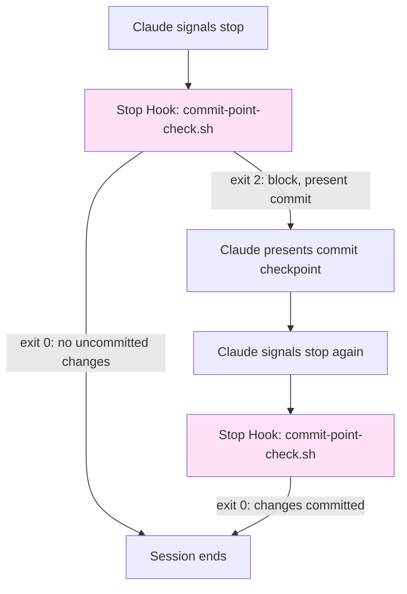

[< Back to Architecture Overview](architecture.md)

# Commit Workflow and Branching Strategy

This document defines the commit protocol for Claude Code sessions: how work is isolated on feature branches, when auto-commits happen, and how they integrate with existing orchestration flows. The design applies to both single-agent sessions and nefario-orchestrated multi-agent sessions.

---

## 1. Branching Strategy

### Branch Creation

At the start of a session that will modify files, create a feature branch from `main`. Branch creation is the first mutating action -- it happens before any file edits.

**Pre-flight checks (before branch creation):**

1. Verify the working tree is clean (`git status --porcelain`). If dirty: warn and stop (fail-closed). The user must stash or commit changes manually.
2. Pull latest main: `git pull --rebase`. If the pull fails: warn and stop.
3. Create the feature branch from the now-up-to-date main.

**Branch naming conventions:**

| Session Type | Pattern | Example |
|-------------|---------|---------|
| Orchestrated (`/nefario`) | `nefario/<slug>` | `nefario/build-mcp-server-with-oauth` |
| Single-agent | `agent/<agent-name>/<slug>` | `agent/frontend-minion/fix-header-layout` |

The slug is derived from the task description: lowercase, kebab-case, max 40 characters, truncated at a word boundary.

**Branch creation rules:**

1. If already on a non-main branch (e.g., the user manually created a branch), use it. Do not create a nested branch.
2. If on `main` or `master`, run pre-flight checks and create the feature branch.

### PR Creation at Wrap-Up

At session wrap-up (after the final auto-commit), offer to create a pull request:

```
PR: "Build MCP server with OAuth" (Y/n)
```

If the user approves:

1. Push the branch to the remote with `git push -u origin <branch-name>`.
2. Create the PR via `gh pr create --title "<title>" --body "<body>"`.
3. The PR body is auto-generated from gate summaries (orchestrated) or the agent's completion summary (single-agent).
4. Display the PR URL.

After PR creation (or if declined), the session stays on the feature branch. The final summary includes the current branch name and a command to return to the default branch when ready: `git checkout <default-branch> && git pull --rebase`.

**Graceful degradation:** If `gh` CLI is not available or not authenticated, skip PR creation and print: `"gh CLI not available. Push your branch and create a PR manually: git push -u origin <branch-name>"`

### Branching Sequence (Orchestrated Session)



---

## 2. Auto-Commit Behavior

After each gate approval and at wrap-up, changes are committed automatically without user interaction.

### Flow

1. Read the change ledger (see Section 6) for files modified since the last commit.
2. Filter entries against the sensitive file patterns (see Section 8).
3. Stage and commit silently (`git commit --quiet`) using a conventional commit message with a Co-Authored-By trailer. The `--quiet` flag suppresses verbose output while preserving error output. Git push and pull also use `--quiet`.
4. Print one informational line: `Committed N files: path1, path2, ...`
5. If no changes since the last commit: skip silently.
6. If the commit fails: print a warning and continue execution.

### Informational Output

After each auto-commit, a single line is printed to keep the user informed without requiring interaction:

```
Committed 3 files: src/auth/device-flow.ts, src/auth/token-store.ts, tests/auth/device-flow.test.ts
```

If more than 10 files, show the first 9 and `+ N more`.

---

## 3. Trigger Points

### Single-Agent Sessions

A Stop hook detects uncommitted changes when the agent finishes and presents a commit checkpoint before the session ends.

**Flow:**

1. Agent completes work and signals stop.
2. Stop hook runs (see Section 7).
3. Hook reads the change ledger (see Section 6) to identify modified files.
4. If the ledger is empty or all changes are already committed, exit 0 (allow stop).
5. If uncommitted changes exist, present the commit checkpoint via stderr (exit 2 to block).
6. After the commit (or rejection), check if on a feature branch. If yes, offer PR creation.
7. Exit 0 to allow stop.

### Orchestrated Sessions

Auto-commits are co-located with gate approvals. They happen silently after each gate is approved, after post-execution phases complete, and once more at wrap-up.

**Flow:**

1. Approval gate is presented and approved by the user.
2. Auto-commit happens silently (informational line only).
3. Post-execution phases (5-8) may produce additional changes (code review fixes, documentation).
4. One auto-commit at wrap-up for remaining changes.
5. PR creation offered at wrap-up.
6. Stay on feature branch after PR creation (or decline). Final summary includes escape hatch to return to default branch.

Auto-commits are co-located with gate approvals because each gate represents a semantic unit of reviewed work.

---

## 4. Anti-Fatigue Rules

Auto-commits require no user interaction, so anti-fatigue measures for commit prompts are not needed. Approval gate anti-fatigue rules (budget, calibration) are documented in the orchestration skill (SKILL.md).

---

## 5. Commit Message Convention

### Format

**Single-agent sessions:**

```
<type>: <summary>

Co-Authored-By: Claude <noreply@anthropic.com>
```

**Orchestrated sessions:**

```
<type>(<scope>): <summary>

Co-Authored-By: Claude <noreply@anthropic.com>
```

The scope in orchestrated sessions is derived from the agent or domain that produced the work (e.g., `oauth`, `frontend`, `security`, `docs`).

### Type Vocabulary

| Type | Use When |
|------|----------|
| `feat` | New functionality |
| `fix` | Bug fix |
| `docs` | Documentation only |
| `refactor` | Code restructuring without behavior change |
| `test` | Adding or modifying tests |
| `chore` | Build, config, tooling changes |
| `style` | Formatting, whitespace (no logic changes) |

### Message Guidelines

- Summary is imperative mood, lowercase, no period: `add device flow token exchange`
- Maximum 72 characters for the first line.
- No body required for checkpoint commits; the PR description carries the narrative.

---

## 6. File Change Tracking

A session-scoped change ledger tracks which files were modified during the session. The auto-commit reads this ledger to determine what to stage.

### Ledger Interface

The ledger is a plain text file, one absolute file path per line. Located at a session-scoped temp path:

```
/tmp/claude-change-ledger-<session-id>.txt
```

### Lifecycle

| Event | Action |
|-------|--------|
| Session start | Delete any existing ledger file for this session. Create empty. |
| PostToolUse (Write) | Append the written file path to the ledger. |
| PostToolUse (Edit) | Append the edited file path to the ledger. |
| Auto-commit | Read the ledger. Deduplicate paths. Stage only ledger entries that have actual `git diff` changes. |
| After commit | Remove committed paths from the ledger (or clear if all were committed). |
| Session end | Delete the ledger file. |

### PostToolUse Hook

A PostToolUse hook on the `Write` and `Edit` tools appends file paths to the ledger:

```bash
#!/usr/bin/env bash
# PostToolUse hook: Track file changes for commit workflow
# Runs after Write and Edit tool calls

set -euo pipefail

LEDGER="/tmp/claude-change-ledger-${CLAUDE_SESSION_ID}.txt"
input=$(cat)
file_path=$(echo "$input" | jq -r '.tool_input.file_path // .tool_input.file_path // empty' 2>/dev/null)

if [[ -n "$file_path" ]]; then
    echo "$file_path" >> "$LEDGER"
fi

exit 0
```

### Why a Ledger Instead of `git status`?

`git status` shows all uncommitted changes, including those from before the session or from manual edits. The ledger tracks only changes made by this Claude session, preventing the auto-commit from proposing to commit unrelated work.

---

## 7. Hook Composition

The commit workflow uses a Stop hook for single-agent commit checkpoints. In orchestrated sessions, auto-commits are driven by SKILL.md instructions rather than hooks. SKILL.md instructions specify `--quiet` flags on `git commit`, `git push`, and `git pull` to suppress verbose output during orchestration. Report generation is handled by the SKILL.md wrap-up instructions, not by a hook.

During nefario-orchestrated sessions, the Stop hook is suppressed by checking for the nefario status file (`/tmp/nefario-status-<session-id>`). This file exists for the duration of any orchestrated session and is removed at wrap-up. When the status file exists, the hook exits 0 immediately, producing no output. This prevents the hook's commit checkpoint from conflicting with the SKILL.md-driven auto-commit flow.

### Execution Order



### Settings Configuration

```json
{
  "hooks": {
    "Stop": [
      {
        "hooks": [
          {
            "type": "command",
            "command": "\"$CLAUDE_PROJECT_DIR\"/.claude/hooks/commit-point-check.sh",
            "timeout": 10
          }
        ]
      }
    ],
    "PostToolUse": [
      {
        "matcher": "Write|Edit",
        "hooks": [
          {
            "type": "command",
            "command": "\"$CLAUDE_PROJECT_DIR\"/.claude/hooks/track-file-changes.sh",
            "timeout": 5
          }
        ]
      }
    ]
  }
}
```

### Infinite Loop Protection

The commit-check hook protects against infinite re-triggering: it checks if the ledger is empty or all ledger entries are committed. After presenting a commit prompt (exit 2), the subsequent re-trigger finds either committed changes (exit 0) or an empty ledger (exit 0). If the user rejected the commit ("n"), the hook sets a session-scoped marker file (`/tmp/claude-commit-declined-<session-id>`) and checks for it on re-entry.

---

## 8. Safety Rails

### Staging Discipline

- **Never use `git add -A` or `git add .`**. Only stage files listed in the change ledger.
- Before staging, verify each file still exists (it may have been deleted after the ledger entry was written).
- Cross-reference ledger entries against `git diff` to ensure there are actual changes (avoid empty commits from no-op edits).

### Sensitive File Detection

Before staging any file, check it against a sensitive file pattern list at `.claude/hooks/sensitive-patterns.txt`:

```
# Sensitive file patterns (one per line, glob syntax)
.env
.env.*
*.pem
*.key
*credentials*
*secret*
*.p12
*.pfx
id_rsa*
id_ed25519*
CLAUDE.local.md
```

**Behavior:** If a ledger entry matches any sensitive pattern, exclude it from the staged files and warn:

```
WARNING: Skipped sensitive file (not staged):
  - .env.local

To include it, stage and commit manually.
```

Sensitive file checking is fail-closed: if the pattern file cannot be read, refuse to stage any files and warn the user.

### Branch Protection

- **Never commit directly to `main` or `master`.** The commit-check hook verifies the current branch before staging.
- If on `main`/`master` and a commit is needed, the hook instructs Claude to create a feature branch first.
- If branch creation fails (e.g., dirty working tree prevents checkout), warn and skip the commit.

### Safety Check Order

```
1. Read change ledger
2. Verify current branch is not main/master
3. Filter ledger against sensitive patterns
4. Verify remaining files have actual git diff changes
5. Stage filtered files
6. Present commit checkpoint (single-agent) or auto-commit (orchestrated)
```

If any check fails, the commit is skipped with a clear warning explaining why.

---

## 9. Edge Cases

### No Changes Made

If the session produces no file changes (e.g., research-only or read-only session), the ledger is empty and no commit is made.

### All Changes Are Sensitive

If every file in the ledger matches a sensitive pattern, no commit is made. The user is warned that all changes were sensitive and must be committed manually.

### Branch Already Exists

If the computed branch name already exists (e.g., from a previous interrupted session), append a numeric suffix: `nefario/build-mcp-server-2`.

### No Git Repository

If the working directory is not a git repository, skip all commit workflow behavior silently. The hooks detect this with `git rev-parse --is-inside-work-tree` and exit 0.

### Detached HEAD

If the repository is in detached HEAD state, warn the user and skip branch creation. Commit checkpoints still work (commits on detached HEAD), but PR creation is skipped.

### Conflict with Manual Commits

If the user manually runs `git commit` during the session, the ledger may contain paths that are already committed. The auto-commit handles this by cross-referencing against `git diff` -- paths with no diff are silently excluded.

### Dirty Working Tree at Session Start

If the working tree has uncommitted changes when the orchestrator tries to pull and create a branch, the session warns and stops (fail-closed). The user must stash or commit changes manually.

---

## 10. Summary

| Concern | Single-Agent | Orchestrated |
|---------|-------------|--------------|
| **Branch creation** | `agent/<name>/<slug>` at session start | `nefario/<slug>` at session start |
| **Commit triggers** | Stop hook (1 checkpoint) | Auto-commit after gate approval + wrap-up |
| **Commit interaction** | Interactive (Y/n) | None (auto-commit, informational line only) |
| **Anti-fatigue** | N/A (single checkpoint) | N/A (no interactive commit prompts) |
| **PR creation** | Offered at wrap-up | Offered at wrap-up |
| **Post-PR branch** | Stays on feature branch | Stays on feature branch |
| **File tracking** | PostToolUse ledger | PostToolUse ledger |
| **Safety rails** | Sensitive patterns, branch protection | Sensitive patterns, branch protection |
