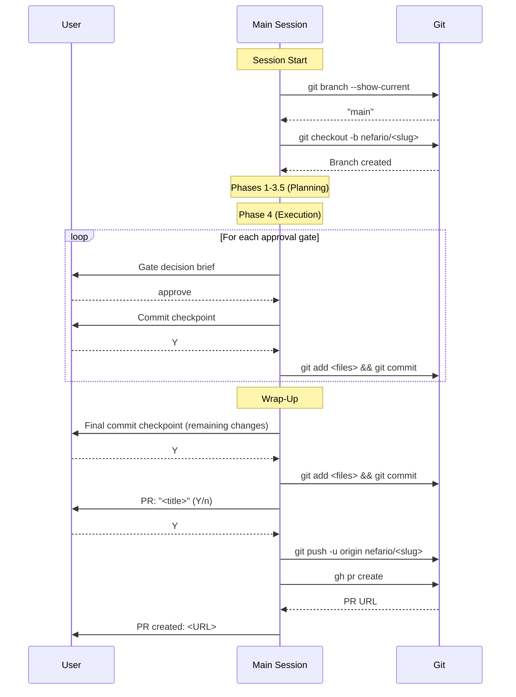

[< Back to Architecture Overview](architecture.md)

# Commit Workflow and Branching Strategy

This document defines the commit interaction protocol for Claude Code sessions: how work is isolated on feature branches, when commit checkpoints are presented, and how they integrate with existing orchestration flows. The design applies to both single-agent sessions and nefario-orchestrated multi-agent sessions.

---

## 1. Branching Strategy

### Branch Creation

At the start of a session that will modify files, create a feature branch from the current HEAD. Branch creation is the first mutating action -- it happens before any file edits.

**Branch naming conventions:**

| Session Type | Pattern | Example |
|-------------|---------|---------|
| Orchestrated (`/nefario`) | `nefario/<slug>` | `nefario/build-mcp-server-with-oauth` |
| Single-agent | `agent/<agent-name>/<slug>` | `agent/frontend-minion/fix-header-layout` |

The slug is derived from the task description: lowercase, kebab-case, max 40 characters, truncated at a word boundary.

**Branch creation rules:**

1. If already on a non-main branch (e.g., the user manually created a branch), use it. Do not create a nested branch.
2. If on `main` or `master`, create the feature branch from HEAD.
3. If the working tree has uncommitted changes when the session starts, warn the user before branching: `"Working tree has uncommitted changes. Create branch anyway? (Y/n)"`

### PR Creation at Wrap-Up

At session wrap-up (after the final commit checkpoint), offer to create a pull request:

```
PR: "Build MCP server with OAuth" (Y/n)
```

If the user approves:

1. Push the branch to the remote with `git push -u origin <branch-name>`.
2. Create the PR via `gh pr create --title "<title>" --body "<body>"`.
3. The PR body is auto-generated from gate summaries (orchestrated) or the agent's completion summary (single-agent).
4. Display the PR URL.

**Graceful degradation:** If `gh` CLI is not available or not authenticated, skip PR creation and print: `"gh CLI not available. Push your branch and create a PR manually: git push -u origin <branch-name>"`

### Branching Sequence (Orchestrated Session)



---

## 2. Commit Checkpoint Format

Commit checkpoints are compact, single-interaction prompts. They present changed files and a conventional commit message, defaulting to "yes."

### Format

```
Commit: "feat(oauth): add device flow token exchange"

  - src/auth/device-flow.ts
  - src/auth/token-store.ts
  - tests/auth/device-flow.test.ts

Co-Authored-By: Claude <noreply@anthropic.com>
(Y/n)
```

### Rules

- **File list**: Show up to 10 changed files as a bullet list. If more than 10, show the first 9 and `+ N more`.
- **Commit message**: Follows the project's conventional commit format (see Section 5).
- **Co-Authored-By trailer**: Always included in the proposed message. Uses `Claude <noreply@anthropic.com>`.
- **Default-yes**: Pressing Enter (empty response) is treated as "Y."
- **Rejection**: If the user says "n", changes remain staged but uncommitted. The user can amend, rewrite the message, or commit manually later.
- **No interactive editing**: The checkpoint does not open an editor. If the user wants to edit the message, they reject and commit manually.

---

## 3. Trigger Points

### Single-Agent Sessions

A Stop hook detects uncommitted changes when the agent finishes and presents a commit checkpoint before the session ends.

**Flow:**

1. Agent completes work and signals stop.
2. Stop hook runs (see Section 7).
3. Hook reads the change ledger (see Section 6) to identify modified files.
4. If the ledger is empty or all changes are already committed, exit 0 (allow stop).
5. If uncommitted changes exist, present the commit checkpoint via stderr (exit 2 to block).
6. After the commit (or rejection), check if on a feature branch. If yes, offer PR creation.
7. Exit 0 to allow stop.

### Orchestrated Sessions

Commit checkpoints are co-located with approval gates. They appear immediately after gate approval, so the user commits the work that was just approved.

**Flow:**

1. Approval gate is presented and approved by the user.
2. Immediately after approval, present a commit checkpoint for the files changed since the last commit.
3. One additional commit checkpoint at wrap-up for any remaining uncommitted work.
4. PR creation offered at wrap-up (after the final commit).

**Why co-locate with gates?** Gates are already interaction boundaries where the user pauses to review. Adding a commit prompt at this point is a natural extension rather than a separate interruption. The user is already in "review and decide" mode.

---

## 4. Anti-Fatigue Rules

Commit prompts must not create approval fatigue. The following rules limit prompt frequency and provide escape hatches.

### Commit Budget

```
commit_budget = gate_budget + 1
```

For orchestrated sessions, the gate budget is 3-5 per plan (from Decision 11). The commit budget is therefore 4-6: one per gate plus one at wrap-up. This prevents commit prompts from exceeding the established interaction budget.

For single-agent sessions, the commit budget is 1 (the wrap-up commit). Mid-session commits are not prompted.

### The `defer-all` Escape Hatch

At any commit checkpoint, the user can respond `defer-all` instead of "Y" or "n":

```
Commit: "feat(oauth): add device flow token exchange"

  - src/auth/device-flow.ts
  - src/auth/token-store.ts

Co-Authored-By: Claude <noreply@anthropic.com>
(Y/n) defer-all
```

**Effect:** All subsequent commit prompts are suppressed until wrap-up. At wrap-up, all deferred changes are presented as a single batch commit:

```
Commit (deferred batch): "feat: build MCP server with OAuth support"

  - src/auth/device-flow.ts
  - src/auth/token-store.ts
  - src/mcp/server.ts
  - src/mcp/tools/github.ts
  - tests/auth/device-flow.test.ts
  - tests/mcp/server.test.ts
  + 3 more

Co-Authored-By: Claude <noreply@anthropic.com>
(Y/n)
```

The deferred batch uses a higher-level commit message summarizing the overall work rather than individual gate-level messages.

### Auto-Defer for Trivial Changes

If all of the following are true, the commit checkpoint is auto-deferred (not presented):

- Only `.md` files were changed.
- Total diff is fewer than 5 lines.

Auto-deferred changes are included in the wrap-up batch. This prevents commit prompts for minor documentation fixes during an orchestration.

### Deferred Recovery

At wrap-up, deferred commits (from `defer-all` or auto-defer) are consolidated:

1. All deferred files are collected from the change ledger.
2. A single batch commit message is proposed.
3. The user approves or rejects the batch.
4. If rejected, changes remain uncommitted on the feature branch.

---

## 5. Commit Message Convention

### Format

**Single-agent sessions:**

```
<type>: <summary>

Co-Authored-By: Claude <noreply@anthropic.com>
```

**Orchestrated sessions:**

```
<type>(<scope>): <summary>

Co-Authored-By: Claude <noreply@anthropic.com>
```

The scope in orchestrated sessions is derived from the agent or domain that produced the work (e.g., `oauth`, `frontend`, `security`, `docs`).

### Type Vocabulary

| Type | Use When |
|------|----------|
| `feat` | New functionality |
| `fix` | Bug fix |
| `docs` | Documentation only |
| `refactor` | Code restructuring without behavior change |
| `test` | Adding or modifying tests |
| `chore` | Build, config, tooling changes |
| `style` | Formatting, whitespace (no logic changes) |

### Message Guidelines

- Summary is imperative mood, lowercase, no period: `add device flow token exchange`
- Maximum 72 characters for the first line.
- No body required for checkpoint commits; the PR description carries the narrative.

---

## 6. File Change Tracking

A session-scoped change ledger tracks which files were modified during the session. The commit checkpoint reads this ledger to determine what to stage.

### Ledger Interface

The ledger is a plain text file, one absolute file path per line. Located at a session-scoped temp path:

```
/tmp/claude-change-ledger-<session-id>.txt
```

### Lifecycle

| Event | Action |
|-------|--------|
| Session start | Delete any existing ledger file for this session. Create empty. |
| PostToolUse (Write) | Append the written file path to the ledger. |
| PostToolUse (Edit) | Append the edited file path to the ledger. |
| Commit checkpoint | Read the ledger. Deduplicate paths. Stage only ledger entries that have actual `git diff` changes. |
| After commit | Remove committed paths from the ledger (or clear if all were committed). |
| Session end | Delete the ledger file. |

### PostToolUse Hook

A PostToolUse hook on the `Write` and `Edit` tools appends file paths to the ledger:

```bash
#!/usr/bin/env bash
# PostToolUse hook: Track file changes for commit workflow
# Runs after Write and Edit tool calls

set -euo pipefail

LEDGER="/tmp/claude-change-ledger-${CLAUDE_SESSION_ID}.txt"
input=$(cat)
file_path=$(echo "$input" | jq -r '.tool_input.file_path // .tool_input.file_path // empty' 2>/dev/null)

if [[ -n "$file_path" ]]; then
    echo "$file_path" >> "$LEDGER"
fi

exit 0
```

### Why a Ledger Instead of `git status`?

`git status` shows all uncommitted changes, including those from before the session or from manual edits. The ledger tracks only changes made by this Claude session, preventing the commit checkpoint from proposing to commit unrelated work.

---

## 7. Hook Composition

The commit workflow uses a Stop hook for commit checkpoints. Report generation is handled by the SKILL.md wrap-up instructions, not by a hook.

### Execution Order


### Settings Configuration

```json
{
  "hooks": {
    "Stop": [
      {
        "hooks": [
          {
            "type": "command",
            "command": "\"$CLAUDE_PROJECT_DIR\"/.claude/hooks/commit-point-check.sh",
            "timeout": 10
          }
        ]
      }
    ],
    "PostToolUse": [
      {
        "matcher": "Write|Edit",
        "hooks": [
          {
            "type": "command",
            "command": "\"$CLAUDE_PROJECT_DIR\"/.claude/hooks/track-file-changes.sh",
            "timeout": 5
          }
        ]
      }
    ]
  }
}
```

### Infinite Loop Protection

The commit-check hook protects against infinite re-triggering: it checks if the ledger is empty or all ledger entries are committed. After presenting a commit prompt (exit 2), the subsequent re-trigger finds either committed changes (exit 0) or an empty ledger (exit 0). If the user rejected the commit ("n"), the hook sets a session-scoped marker file (`/tmp/claude-commit-declined-<session-id>`) and checks for it on re-entry.

---

## 8. Safety Rails

### Staging Discipline

- **Never use `git add -A` or `git add .`**. Only stage files listed in the change ledger.
- Before staging, verify each file still exists (it may have been deleted after the ledger entry was written).
- Cross-reference ledger entries against `git diff` to ensure there are actual changes (avoid empty commits from no-op edits).

### Sensitive File Detection

Before staging any file, check it against a sensitive file pattern list at `.claude/hooks/sensitive-patterns.txt`:

```
# Sensitive file patterns (one per line, glob syntax)
.env
.env.*
*.pem
*.key
*credentials*
*secret*
*.p12
*.pfx
id_rsa*
id_ed25519*
CLAUDE.local.md
```

**Behavior:** If a ledger entry matches any sensitive pattern, exclude it from the staged files and warn:

```
WARNING: Skipped sensitive file (not staged):
  - .env.local

To include it, stage and commit manually.
```

Sensitive file checking is fail-closed: if the pattern file cannot be read, refuse to stage any files and warn the user.

### Branch Protection

- **Never commit directly to `main` or `master`.** The commit-check hook verifies the current branch before staging.
- If on `main`/`master` and a commit is needed, the hook instructs Claude to create a feature branch first.
- If branch creation fails (e.g., dirty working tree prevents checkout), warn and skip the commit.

### Safety Check Order

```
1. Read change ledger
2. Verify current branch is not main/master
3. Filter ledger against sensitive patterns
4. Verify remaining files have actual git diff changes
5. Stage filtered files
6. Present commit checkpoint
```

If any check fails, the commit checkpoint is skipped with a clear warning explaining why.

---

## 9. Edge Cases

### No Changes Made

If the session produces no file changes (e.g., research-only or read-only session), the ledger is empty and no commit checkpoint is presented.

### All Changes Are Sensitive

If every file in the ledger matches a sensitive pattern, no commit checkpoint is presented. The user is warned that all changes were sensitive and must be committed manually.

### Branch Already Exists

If the computed branch name already exists (e.g., from a previous interrupted session), append a numeric suffix: `nefario/build-mcp-server-2`.

### No Git Repository

If the working directory is not a git repository, skip all commit workflow behavior silently. The hooks detect this with `git rev-parse --is-inside-work-tree` and exit 0.

### Detached HEAD

If the repository is in detached HEAD state, warn the user and skip branch creation. Commit checkpoints still work (commits on detached HEAD), but PR creation is skipped.

### Conflict with Manual Commits

If the user manually runs `git commit` during the session, the ledger may contain paths that are already committed. The commit checkpoint handles this by cross-referencing against `git diff` -- paths with no diff are silently excluded.

---

## 10. Summary

| Concern | Single-Agent | Orchestrated |
|---------|-------------|--------------|
| **Branch creation** | `agent/<name>/<slug>` at session start | `nefario/<slug>` at session start |
| **Commit triggers** | Stop hook (1 checkpoint) | Co-located with gates + wrap-up |
| **Commit budget** | 1 | gate_budget + 1 (typically 4-6) |
| **Anti-fatigue** | N/A (single checkpoint) | defer-all, auto-defer for trivial |
| **PR creation** | Offered at wrap-up | Offered at wrap-up |
| **File tracking** | PostToolUse ledger | PostToolUse ledger |
| **Safety rails** | Sensitive patterns, branch protection | Sensitive patterns, branch protection |
