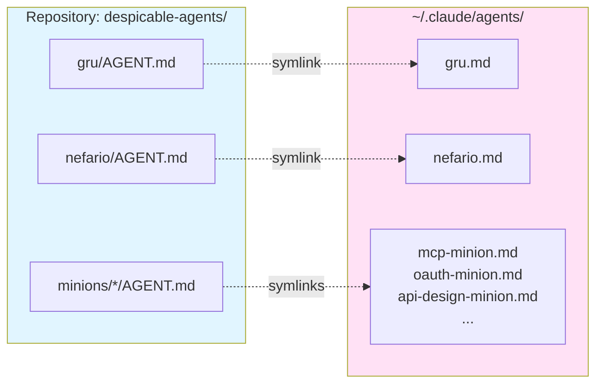

[< Back to Architecture Overview](architecture.md)

# Deployment

Agents are deployed to Claude Code via symlinks from the repository to `~/.claude/agents/`. Edits to agent files in the repository are immediately live -- no reinstall, restart, or copy step required.

## Symlink Deployment Model



Each `AGENT.md` in the repository is symlinked to `~/.claude/agents/<name>.md`. Claude Code discovers agents by scanning that directory, so symlinking is sufficient for deployment.

Only `AGENT.md` files are deployed. `RESEARCH.md`, `AGENT.generated.md`, and `AGENT.overrides.md` remain in the repository as build artifacts and source material -- they are not visible to Claude Code.

## install.sh

The `install.sh` script at the repository root manages symlink creation and removal.

### Usage

```bash
./install.sh           # Install all agents (create symlinks)
./install.sh install   # Same as above (explicit)
./install.sh uninstall # Remove all symlinks created by this project
```

### Behavior

**Install**: Creates the `~/.claude/agents/` directory if it does not exist, then symlinks each `AGENT.md` to that directory using absolute paths. Iterates over `gru/AGENT.md`, `nefario/AGENT.md`, and all `minions/*/AGENT.md` files.

**Uninstall**: Removes symlinks from `~/.claude/agents/` only if they point back to this repository. Symlinks created by other projects or manually are left untouched.

**Idempotent**: Safe to run multiple times. Uses `ln -sf` (symbolic link, force), so re-running install overwrites existing symlinks without error.

**Absolute paths**: All symlinks use absolute paths resolved from the script's location. The repository can live anywhere on disk.

## Benefits

**Instant updates**: Edits to any `AGENT.md` in the repository are immediately visible to Claude Code. No reinstall or restart required -- the symlink always resolves to the current file content.

**Version control**: All agent files are tracked in Git with full history. Changes are reviewable, diffable, and attributable.

**Easy rollback**: `git checkout <version>` rolls back all agents to a previous state. The symlinks continue to point to the same file paths, so the rolled-back content is immediately live.

**Development workflow**: Edit agents locally, test immediately in Claude Code, commit when stable. No deployment step between editing and testing.

**Multi-machine sync**: Clone the repository on another machine, run `./install.sh`, and all agents are deployed. Git pull keeps agents in sync across machines.

## Hook Deployment

Two hook scripts in `.claude/hooks/` extend Claude Code's behavior for commit workflow automation. Hooks are registered in `.claude/settings.json` and run automatically during sessions.

### Hook Scripts

| Script | Event | Purpose |
|--------|-------|---------|
| `track-file-changes.sh` | PostToolUse (Write, Edit) | Appends modified file paths to a session-scoped change ledger. The ledger tracks which files the current session changed, so commit checkpoints only propose session-produced changes. |
| `commit-point-check.sh` | Stop | Reads the change ledger, filters sensitive files, and presents a commit checkpoint if uncommitted session changes exist. |

### Settings Configuration

Hooks are registered in `.claude/settings.json` at the project root. The configuration specifies event types and matchers:

- **Stop hooks**: The commit-check hook uses exit code 2 to block session exit and provide instructions via stderr, with built-in infinite loop protection.
- **PostToolUse hooks** use a matcher to fire only on `Write` and `Edit` tool calls. The hook appends the file path to the change ledger with minimal overhead (< 5ms per call).

Report generation is enforced by the nefario SKILL.md wrap-up instructions, not by a hook.

### Prerequisites

- Hook scripts must have execute permissions: `chmod +x .claude/hooks/*.sh`
- `jq` must be installed for JSON parsing in hooks

See [commit-workflow.md](commit-workflow.md) Section 7 for hook composition design and [commit-workflow-security.md](commit-workflow-security.md) for security properties of hook scripts.

## The Nefario Skill

The nefario orchestration skill is deployed separately from agents. It lives at `~/.claude/skills/nefario/` and is not managed by `install.sh`. The skill bridges nefario's planning intelligence to the main Claude Code session's execution capability.

See [Orchestration and Delegation](orchestration.md) for details on the nefario skill's role, deployment, and nine-phase orchestration process.
