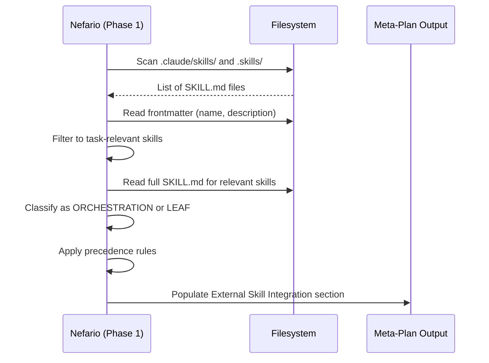

[< Back to Architecture Overview](architecture.md)

# External Skill Integration

How nefario discovers and incorporates project-shipped skills (Claude Code SKILL.md files) during orchestration. This document is for contributors extending nefario's behavior and for skill authors who want their skills to work under orchestration without modification.

For the user-facing orchestration guide, see [Using Nefario](using-nefario.md). For the nine-phase process that this mechanism plugs into, see [Orchestration and Delegation](orchestration.md).

---

## How It Works

Any existing Claude Code skill works with nefario at zero effort. If your SKILL.md has a `name` and `description` in its frontmatter, nefario can discover it during Phase 1 (meta-plan) and incorporate it into the execution plan. No despicable-agents-specific metadata or coupling is needed.

During meta-planning, nefario scans project skill directories and reads frontmatter to identify skills relevant to the current task. Each relevant skill is classified as one of two types based on content signals:

- **ORCHESTRATION** -- Multi-phase workflows with internal sequencing. These receive a single deferred macro-task in the execution plan. Nefario does not decompose the skill's internal phases.
- **LEAF** -- Single-action tools with clear input/output. These are listed in the `Available Skills` section of relevant task prompts for executing agents to use directly.

When an external skill overlaps with a built-in specialist, a three-tier precedence model determines which takes priority. Cross-cutting concerns (security, testing, governance) always stay with internal specialists.

---

## Discovery

### Scanned Directories

Nefario scans two directories relative to the working directory:

- `.claude/skills/` -- project-local skills (Claude Code convention)
- `.skills/` -- alternative project-local location

User-global skills from `~/.claude/skills/` are also noted, excluding despicable-agents' own agents.

### What Is Read

For each discovered skill, nefario reads only the SKILL.md frontmatter (`name`, `description`) for initial triage. This keeps context costs low when a project ships many skills.

Skills whose description matches the current task domain get a full read for classification. Content from external skills is wrapped in `<external-skill>` tags before reasoning to maintain content boundaries between skill instructions and orchestration logic.

### Path Validation

Discovered paths are validated with `realpath` to confirm they resolve within expected parent directories. Symlinks escaping to unexpected locations are rejected.

### Name Collisions

If an external skill shares a name with a despicable-agents agent, nefario disambiguates by prefixing with the source directory (e.g., `.skills/nefario` vs the internal nefario agent).

---

## Precedence Rules

When an external skill overlaps with a built-in specialist, three tiers resolve which takes priority:

1. **CLAUDE.md explicit preferences** (highest) -- If the project's CLAUDE.md declares a skill preference or override, it wins unconditionally. Example: `"Always use .skills/deploy for deployment"` overrides iac-minion for deployment tasks.
2. **Project-local over global** -- `.claude/skills/` and `.skills/` beat `~/.claude/skills/` when both cover the same domain. A project-local deployment skill takes precedence over a user-global one.
3. **Specificity over generality** -- A domain-specific external skill (e.g., a custom `rails-api` skill) beats a generic internal specialist (api-design-minion) for that domain. The external skill has narrower, deeper expertise.

### Cross-Cutting Exception

Internal specialists always retain ownership of cross-cutting concerns regardless of external skill specificity. Security-minion, test-minion, accessibility-minion, and governance agents (lucy, margo) are never overridden by external skills.

### Ambiguity Handling

When precedence is genuinely ambiguous -- neither tier clearly applies -- the choice is presented at the execution plan approval gate rather than resolved silently. The user sees both options with a rationale for each.

---

## Deferral Mechanism

When an ORCHESTRATION skill covers a sub-task, nefario models it as a single macro-task in the delegation plan marked `Delegation type: DEFERRED`. Nefario does not decompose the skill's internal phases or inject its own phases into the skill's workflow.

The deferred task runs in the main session context via native skill invocation, not as a spawned subagent. This preserves the skill's own execution model while integrating it into the broader plan.

Cross-cutting reviews (security, testing, governance) still apply to deferred output. The deferred task's output is gated before downstream tasks proceed, ensuring the skill's deliverables meet the same quality bar as internal agent output.

For LEAF skills, the skill name and path are included in the `Available Skills` section of the relevant execution task prompts. The executing agent reads and follows the skill as needed -- no deferral is involved.

---

## Trust and Security

Skills are trusted because the user installed them -- the same trust model as any Claude Code skill. A skill in `.claude/skills/` or `~/.claude/skills/` has the same implicit trust as any other code in the project or user configuration. No custom permission layer exists on top of Claude Code's native permission model.

Content boundaries (`<external-skill>` tags) prevent skill content from being interpreted as orchestration-level instructions. This is a content isolation measure, not a security sandbox -- it ensures that nefario reasons about skill content rather than executing it as orchestration commands.

Claude Code's built-in permission system remains the sole enforcement point for all tool access, file operations, and network requests. Skills cannot escalate permissions beyond what the user has granted.

---

## Known Limitations

- **Context pressure** -- Projects with many skills (15+) may strain the context budget during Phase 1 discovery. Nefario reads full content only for domain-relevant skills to mitigate this, but frontmatter reads still accumulate.
- **Missing frontmatter** -- Skills without a `name` or `description` in their SKILL.md frontmatter are skipped during discovery. No warning is surfaced.
- **Ambiguous overlap** -- When a skill's domain overlaps with a built-in specialist and precedence is unclear, the choice surfaces at the approval gate. This adds interaction overhead but avoids silent misrouting.
- **Heuristic classification** -- ORCHESTRATION vs. LEAF classification is based on content signals (multiple phases, step ordering, conditional branching), not deterministic metadata. Ambiguous cases default to LEAF (safer: the skill gets included as a resource rather than delegated to).

---

## For Skill Maintainers

This section is self-contained. You do not need to read the rest of this document or understand despicable-agents internals to make your skill work under orchestration.

### Tier 0: Works Automatically

If your SKILL.md has a `name` and `description` in its frontmatter, nefario can discover and use it. No changes are needed.

Minimal example that works both standalone and under orchestration:

```yaml
---
name: deploy-preview
description: Deploy a preview environment for the current branch
---

# Deploy Preview

Run `./scripts/deploy-preview.sh` for the current branch.
Outputs the preview URL when complete.
```

This skill works as a normal Claude Code skill when invoked directly. Under nefario orchestration, it enhances the execution plan by appearing in the `Available Skills` section of relevant task prompts.

### Tier 1: Phased Workflows (Optional)

If your skill defines multiple named phases or steps with ordering, nefario auto-detects it as an ORCHESTRATION skill and defers to it as a single macro-task. You do not need to add metadata for this -- the classification is based on content signals.

This is optional. Most skills work well as LEAF skills and do not need phased structure.

### What NOT to Do

- **No despicable-agents-specific metadata.** Do not add fields that only make sense under nefario orchestration. The classification is heuristic and does not depend on special fields.
- **No coupling back.** Do not reference despicable-agents internals (agent names, delegation tables, phase numbers) in your skill. Your skill should work identically with or without nefario.
- **No `keywords` field.** The `description` field is sufficient for domain matching. A dedicated keywords field was considered and dropped from the design.

---

## Discovery Flow


