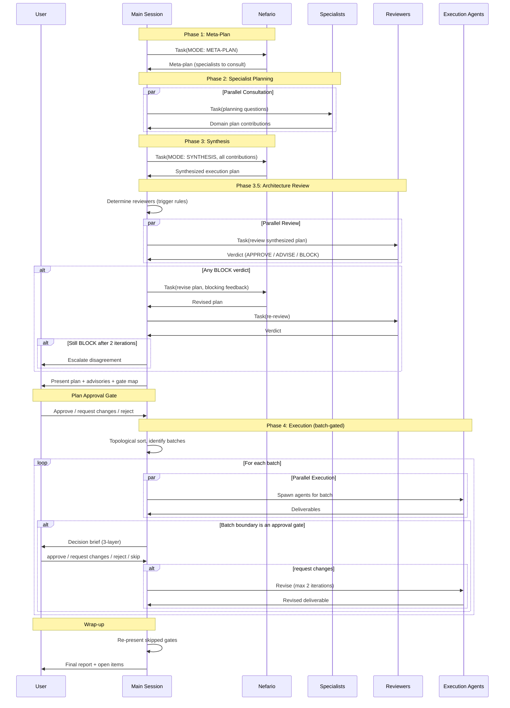

[< Back to Architecture Overview](architecture.md)

# Orchestration and Delegation

This document covers how to use nefario for multi-agent tasks (Section 1), the architecture of the five-phase planning process (Section 2), the delegation model that routes work to specialists (Section 3), and the approval gate mechanism that keeps the user in control of high-impact decisions (Section 4).

---

## 1. Using Nefario

Nefario is the orchestrator for complex, multi-domain tasks. When a task spans multiple specialist areas, nefario decomposes it, routes work to the right experts, and coordinates their collaboration.

### When to Use Nefario

Use `/nefario` when your task requires multiple specialists working together. Use individual agents directly for single-domain work.

**Use `/nefario` for:**

- "Build an MCP server with OAuth, tests, and user documentation" -- spans mcp-minion, oauth-minion, test-minion, user-docs-minion
- "Create a new REST API with security review, observability, and API docs" -- spans api-design-minion, security-minion, observability-minion, software-docs-minion
- "Add edge caching to our app with monitoring and performance testing" -- spans edge-minion, observability-minion, test-minion
- "Design and implement a user onboarding flow with UI, docs, and analytics" -- spans ux-strategy-minion, ux-design-minion, frontend-minion, user-docs-minion, observability-minion

**Call specialists directly for:**

- "Fix this CSS layout bug in the header component" -- `@frontend-minion`
- "Review this API design for REST best practices" -- `@api-design-minion`
- "Should we adopt the new Agent-to-Agent protocol?" -- `@gru`
- "Write a troubleshooting guide for this error message" -- `@user-docs-minion`
- "Debug why this function is leaking memory" -- `@debugger-minion`

**Rule of thumb**: If you can name the single specialist who should handle it, call them directly. If you need to say "we'll need X, Y, and Z working together," use `/nefario`.

### How to Invoke

```
/nefario <describe your task>
```

Be specific in your task description. More context leads to better planning.

**Good examples:**
```
/nefario Build an MCP server that provides GitHub repository tools with OAuth
authentication. Include tests and user documentation. Target users are
developers integrating GitHub into their Claude workflows.

/nefario Create a REST API for user management (CRUD operations) with JWT
authentication, rate limiting, comprehensive error handling, OpenAPI
documentation, and observability instrumentation.

/nefario Design and implement a developer onboarding tutorial for our CLI tool.
The tutorial should walk through installation, basic usage, and common
workflows. Include interactive examples and troubleshooting tips.
```

**Less helpful examples:**
```
/nefario Build something with MCP
/nefario Make the API better
/nefario Fix the docs
```

### What Happens: The Five Phases

Nefario uses a structured planning process that taps into specialist expertise before execution begins.

**Phase 1 -- Meta-Planning.** Nefario reads your codebase and analyzes the task against its delegation table to figure out which specialists should contribute to planning. You see the list of specialists and what each will be asked. No approval needed -- this is informational.

**Phase 2 -- Specialist Planning.** Each identified specialist is spawned as a subagent and asked for domain-specific planning input. This happens in parallel. Specialists contribute recommendations, proposed tasks, and risk assessments from their area of expertise.

**Phase 3 -- Synthesis.** Nefario takes all specialist input and consolidates it into a single execution plan with specific tasks, owners, dependencies, and complete agent prompts. Conflicts between specialists are resolved here. Cross-cutting concerns (security, testing, documentation, usability, observability) are verified -- if a specialist did not raise them, nefario adds them.

**Phase 3.5 -- Architecture Review.** Cross-cutting reviewers examine the synthesized plan before any code is written. Security and testing reviews are mandatory; others trigger conditionally based on plan scope. Reviewers return APPROVE, ADVISE (non-blocking warnings), or BLOCK (halts execution until resolved). This catches architectural issues that are cheap to fix in a plan and expensive to fix in code.

**Phase 4 -- Execution.** After you approve the plan, the main session creates a team and spawns specialist agents with the prompts from the plan. Independent tasks run in parallel. Tasks with dependencies run in sequence. Approval gates pause execution at high-impact decision points (see Section 4). When all tasks finish, results are synthesized and presented to you.

### Tips for Success

**Be specific in your task description.** Include context about target users, required features, and constraints. "Build an MCP server with auth" is vague. "Build an MCP server for GitHub integration with OAuth device flow, targeting developers using Claude Code" gives nefario and the specialists clear direction.

**Review the plan before approving.** The synthesis phase presents a complete execution plan. If something looks wrong or incomplete, ask for modifications before execution begins.

**For simple tasks, skip nefario.** If you know exactly which specialist you need and the scope is clear, call them directly with `@specialist-name`. Orchestration overhead is unnecessary for single-domain work.

**Trust the specialists.** Nefario consults domain experts for planning, which catches issues early. If oauth-minion says "device flow is better than web redirect for CLI tools," that is domain expertise you benefit from.

**Use MODE: PLAN for simpler multi-agent tasks.** The skill supports a simplified mode that skips specialist consultation and has nefario plan directly. This works well when you know which 2-3 agents you need and the handoffs are straightforward.

### Platform Constraint

Custom agents invoked via `claude --agent` do not receive the Task tool from the Claude Code runtime. This means nefario cannot spawn specialist agents directly. The `/nefario` skill works around this by keeping the main session (which has the Task tool) as the executor, while nefario provides the planning intelligence. If the Task tool becomes available to custom agents in a future Claude Code version, nefario automatically switches to direct orchestration.

---

## 2. Five-Phase Planning Architecture

The orchestration system implements a five-phase planning process that separates planning intelligence from execution capability. Nefario provides the planning; the main Claude Code session provides the spawning.

### Phase 1: Meta-Plan

The main session spawns nefario with `MODE: META-PLAN`. Nefario reads the codebase, analyzes the task against the delegation table, and returns a structured meta-plan identifying:

- Which specialists to consult for planning (with specific questions for each)
- Cross-cutting checklist evaluation (all six dimensions assessed)
- Anticipated approval gates
- Scope boundaries (in/out)

The meta-plan is informational. No user approval is required before proceeding to Phase 2.

### Phase 2: Specialist Planning

The main session spawns each specialist identified in the meta-plan as a subagent, passing the specialist-specific planning question and relevant codebase context. Specialists run in parallel.

Each specialist returns a domain plan contribution containing:

- Recommendations grounded in domain expertise
- Proposed tasks with deliverables
- Risks and constraints from their perspective
- Dependencies on or interactions with other specialists' work

### Phase 3: Synthesis

The main session spawns nefario with `MODE: SYNTHESIS`, passing all specialist contributions. Nefario consolidates input into a final execution plan:

1. Resolves conflicts between specialists using project priorities
2. Incorporates risk mitigations from specialist input
3. Adds agents that specialists recommended but were not in the original meta-plan
4. Fills gaps by checking the six cross-cutting dimensions against the plan
5. Classifies approval gates using the reversibility/blast-radius matrix
6. Produces the execution order (topological sort with batch boundaries and gate positions)
7. Identifies which architecture reviewers the plan triggers

The synthesis output includes self-contained prompts for each execution agent -- complete with scope, constraints, deliverables, file paths, and explicit "do NOT do" boundaries.

### Phase 3.5: Architecture Review

Before execution begins, cross-cutting specialists review the synthesized plan. This phase catches architectural issues that are cheap to fix in a plan and expensive to fix in code.

**Review triggering rules:**

| Reviewer | Trigger | Rationale |
|----------|---------|-----------|
| security-minion | ALWAYS | Security violations in a plan are invisible until exploited |
| test-minion | ALWAYS | Retrofitting test coverage is consistently more expensive than designing it in |
| ux-strategy-minion | ALWAYS | Every plan needs journey coherence and cognitive load assessment |
| software-docs-minion | ALWAYS | Architectural and API surface changes need documentation review |
| observability-minion | Conditional: 2+ tasks produce runtime components | Multiple runtime tasks need coordinated observability strategy |
| ux-design-minion | Conditional: 1+ tasks produce user-facing interfaces | UI-producing tasks need accessibility patterns review |

All reviewers run on **sonnet**. Architecture review is pattern-matching against known concerns, not deep reasoning.

**Verdict format:**

Each reviewer returns exactly one of three verdicts:

- **APPROVE** -- No concerns. The plan adequately addresses this reviewer's domain.
- **ADVISE** -- Non-blocking warnings. Advisories are appended to relevant task prompts and presented to the user alongside the plan. They do not block execution.
- **BLOCK** -- Halts execution. The blocking concern is sent to nefario for plan revision. The blocking reviewer re-reviews the revised plan. If still blocked after 2 iteration rounds, the disagreement escalates to the user with both positions presented.

After all reviews complete and any BLOCK verdicts are resolved, the plan (with advisories attached) is presented to the user for approval.

### Phase 4: Execution

After user approval, the main session executes the plan using batch-gated execution:

1. Topological sort determines task order from the dependency graph
2. Approval gates create batch boundaries (split points)
3. All tasks that can run before the next gate form a batch
4. The batch executes (parallel where dependencies allow)
5. When a gate is reached, the decision brief is presented to the user
6. On approval, the next batch of unblocked tasks executes
7. The cycle repeats until all tasks complete

At wrap-up, any skipped gates are re-presented. A final report summarizes deliverables, verification results, known issues, and next steps.

### Delegation Flow



---

## 3. Delegation Model

The delegation model ensures every piece of work has exactly one primary agent, with clear supporting roles and no overlaps.

### Boundary Enforcement Mechanisms

Four mechanisms enforce strict agent boundaries:

**"Does NOT do" sections.** Every agent's system prompt explicitly lists what it does not handle, with named delegation targets. These create hard boundaries. For example, security-minion does not implement authentication flows -- it delegates to oauth-minion.

**Delegation table.** Nefario's embedded routing table maps task types to primary and supporting agents deterministically. The table covers all six domain groups and eliminates ambiguity in task assignment.

**Handoff triggers.** Specific phrases or request types trigger delegation to named specialists. When an agent encounters work outside its boundary, it names the target agent rather than attempting the work.

**File ownership.** No two agents modify the same file in a single plan. If multiple perspectives are needed on a file, work is sequenced (one agent writes, another reviews) or one agent integrates changes from multiple sources.

### Primary vs. Supporting Agent Roles

**Primary agent**: Owns the deliverable. Performs the core work. Has final decision-making authority within its domain. For REST API design, api-design-minion is primary.

**Supporting agent**: Provides input, reviews from its perspective, handles secondary concerns. Does not own the deliverable. For REST API design, software-docs-minion provides a documentation perspective as supporting.

**Collaboration pattern**: The primary agent produces initial work. Supporting agents review and contribute their specialized perspective. The primary agent integrates feedback and delivers the final output.

### Cross-Cutting Concerns

Every plan is evaluated against a six-dimension checklist. For each dimension, nefario either includes the relevant agent or provides explicit justification for excluding it. Silent omission is not permitted.

| Dimension | Agent | Inclusion Rule |
|-----------|-------|---------------|
| Testing | test-minion | Include unless the task is purely research or design with no executable output |
| Security | security-minion | Include for any task touching auth, APIs, user input, or infrastructure |
| Usability -- Strategy | ux-strategy-minion | ALWAYS include |
| Usability -- Design | ux-design-minion | Include when tasks produce user-facing interfaces |
| Documentation | software-docs-minion / user-docs-minion | ALWAYS include |
| Observability | observability-minion | Include for any runtime component (services, APIs, background processes) |

The checklist applies in all modes (META-PLAN, SYNTHESIS, PLAN). The default is to include; exclusion requires justification.

### Escalation Paths

**To gru**: When strategic technology decisions are needed (adopt/hold/wait framework), protocol evaluation, or technology radar assessment.

**To nefario**: When a single-agent task grows into multi-domain complexity requiring coordination.

**To user**: When priorities are unclear, requirements are ambiguous, specialists disagree after arbitration, or major risks are identified that require human judgment.

---

## 4. Approval Gates

Approval gates pause execution to get user input on a deliverable before downstream work proceeds. The mechanism is designed to gate high-impact decisions without creating approval fatigue.

### Gate Classification

Gates are classified on two dimensions: **reversibility** (how hard is it to undo this decision?) and **blast radius** (how many downstream tasks depend on it).

| | Low Blast Radius (0-1 dependents) | High Blast Radius (2+ dependents) |
|---|---|---|
| **Easy to Reverse** (config, additive code, docs) | NO GATE | OPTIONAL gate |
| **Hard to Reverse** (schema, API contract, architecture, security model) | OPTIONAL gate | MUST gate |

**Supplementary rule**: If a task has dependents AND involves judgment where multiple valid approaches exist (not a clear best-practice situation), gate it regardless of reversibility.

Examples of MUST-gate tasks: database schema design, API contract definition, UX strategy recommendations, security threat model. Examples of no-gate tasks: CSS styling, test file organization, documentation formatting.

### Decision Brief Format

Decision briefs use three layers of progressive disclosure to respect the user's time:

**Layer 1 (5-second scan)**: One-sentence description of the decision.
**Layer 2 (30-second read)**: Rationale with 3-5 bullets, including at least one rejected alternative and the reason it was rejected.
**Layer 3 (deep dive)**: The full deliverable at its file path.

CLI format:

```
APPROVAL GATE: <title>
Agent: <who> | Blocked tasks: <what's waiting>

DECISION: <one sentence>

RATIONALE:
- <point 1>
- <point 2>
- <point 3 -- must include at least one rejected alternative>

IMPACT: <consequences of approving vs. rejecting>
DELIVERABLE: <file path>
Confidence: HIGH | MEDIUM | LOW

Reply: approve / request changes / reject / skip
```

### Response Handling

- **approve** -- Gate clears. Downstream tasks are unblocked.
- **request changes** -- The producing agent revises. Capped at 2 revision iterations. If still unsatisfied, the current state is presented with a summary of what was requested, changed, and unresolved. The user then decides to approve as-is, reject, or take over manually.
- **reject** -- Before executing the rejection, downstream impact is presented: "Rejecting this will also drop Task X, Task Y which depend on it. Confirm?" After confirmation, the rejected task and all dependents are removed from the plan.
- **skip** -- Gate deferred. Execution continues with non-dependent tasks. Skipped gates are re-presented at wrap-up. If skipped gates still block downstream tasks at wrap-up, those tasks remain incomplete and are flagged in the final report.

### Anti-Fatigue Rules

Approval fatigue is the primary threat to this mechanism. A fatigued user rubber-stamps everything, which makes gates worse than useless.

**Gate budget.** Target 3-5 gates per plan. If synthesis produces more than 5, nefario consolidates related gates or downgrades low-risk gates to non-blocking notifications. The synthesis output flags when the budget is exceeded.

**Confidence indicator.** Every gate includes HIGH, MEDIUM, or LOW confidence. HIGH means clear best practice (likely quick approve). MEDIUM means reasonable approach but alternatives have merit. LOW means significant uncertainty -- the user should read Layer 2 carefully and may want to inspect Layer 3.

**Rejected alternatives mandatory.** Every gate's Layer 2 rationale must include at least one rejected alternative. This is the primary anti-rubber-stamping measure: it forces the user to consider whether the chosen approach is genuinely better than the alternatives.

**Calibration check.** After 5 consecutive approvals without any "request changes" or "reject" response, nefario presents a calibration prompt asking whether the gates are well-calibrated or should be reduced. The response is recorded in nefario's memory to tune future plans.

### Cascading Gates

When a plan has multiple gates with dependencies between them:

- **Dependency order is mandatory.** A gate that depends on an unapproved prior gate is never presented. The downstream deliverable assumes the upstream deliverable is correct.
- **Parallel independent gates are presented sequentially**, ordered by confidence ascending (LOW first, then MEDIUM, then HIGH) so the hardest decisions get the user's freshest attention.
- **Maximum 3 levels of dependent gates.** If a plan has more than 3 levels of sequential gate dependencies, nefario restructures the plan or consolidates gates.

**Gate vs. notification.** Not every important output needs a blocking gate. Non-blocking notifications are used for completed milestones, ADVISE verdicts from architecture review, and intermediate outputs that are informational but do not require approval.

---

## 5. Execution Reports

Every `/nefario` orchestration produces a decision log documenting the agents involved, key decisions, and outcomes. Reports serve three use cases: immediate confirmation ("what just happened?"), future decision reference ("why did we choose X six months ago?"), and process comparison ("are gates being overused?").

### Report Location and Naming

Reports are written to `nefario/reports/<YYYY-MM-DD>-<NNN>-<slug>.md`:

- `<YYYY-MM-DD>`: Orchestration date
- `<NNN>`: Zero-padded sequence number (001, 002, etc.) -- first report of the day is 001
- `<slug>`: Kebab-case task summary derived from the task description (max 40 characters)

Example: `nefario/reports/2026-02-09-001-build-mcp-server-with-oauth.md`

The `nefario/reports/` directory is created automatically on first use.

### Report Structure

Reports use three-layer progressive disclosure to respect reading time:

**Layer 1 -- Header Block (5-second scan)**: A markdown table with key metrics: date, task summary, duration, outcome, agent counts, gates presented/approved, files changed, outstanding items. Enough information to answer "did this work?" at a glance.

**Layer 2 -- Executive Summary + Decisions (2-minute read)**: A 2-3 sentence summary of what was accomplished, followed by structured decision sections. Each decision includes the decision statement, rationale (2-5 key points), and alternatives that were rejected. Conflict resolutions between specialists are documented here if any occurred.

**Layer 3 -- Process Detail (deep dive)**: Detailed breakdowns by phase, including which agents ran in each phase, files created or modified (with descriptions), approval gate outcomes (with confidence levels and revision rounds), outstanding items as a markdown checklist, and timing breakdown. This layer is for future debugging and process calibration.

The full template is maintained in the `/nefario` skill. Do not reproduce it here -- the skill is the authoritative source.

### Index

All reports are cataloged in `nefario/reports/index.md`, a table listing date, sequence number, task summary (as a link to the report), outcome, and agent count. The index is updated automatically at wrap-up. It provides a chronological view of all orchestration runs for cross-run analysis.

### When Reports Are Generated

Reports are generated at wrap-up, after execution completes but before team cleanup. For long-running orchestrations, a partial report may be written after synthesis (Phase 3) and overwritten with the complete report at wrap-up. Interrupted orchestrations may leave partial reports in place -- these are marked with `outcome: partial` in the frontmatter.

### Report Enforcement

Report generation is enforced by the nefario SKILL.md wrap-up sequence. The wrap-up steps are marked as mandatory and the orchestrator is instructed to never skip or defer the report. This is the same mechanism that enforces all other orchestration steps (synthesis, architecture review, etc.) — the skill instructions govern the process end-to-end.

### Troubleshooting

**Report not generated:**
- Verify the nefario skill is loaded (invoked via `/nefario`)
- Check that `nefario/reports/` directory exists and is writable
- Review the conversation for error messages from the Write tool

**Reports generated multiple times:**
- This indicates the infinite loop protection failed. Check the `stop_hook_active` flag logic in the script.
- File an issue if this occurs consistently.

---

## 6. Commit Points in Execution Flow

Execution sessions produce file changes that need version control. Commit checkpoints are integrated into the orchestration flow at natural pause points, so committing work does not introduce separate interruptions.

### Feature Branch Creation

At the start of any session that will modify files, a feature branch is created from HEAD before any edits occur:

- **Orchestrated sessions**: `nefario/<slug>` (e.g., `nefario/build-mcp-server-with-oauth`)
- **Single-agent sessions**: `agent/<agent-name>/<slug>` (e.g., `agent/frontend-minion/fix-header-layout`)

If already on a non-main branch (user-created), the existing branch is used. If the working tree has uncommitted changes, the user is warned before branching.

### Commit Checkpoints and Approval Gates

In orchestrated sessions, commit checkpoints are co-located with approval gates. After the user approves a gate, a commit checkpoint immediately follows, proposing to commit the files changed since the last commit. This reuses the existing "review and decide" pause rather than creating a separate interaction.

```
[Gate approved] --> [Commit checkpoint] --> [Next batch executes]
```

For single-agent sessions, a single commit checkpoint is presented at session end via a Stop hook.

### Commit Budget

The number of commit prompts is bounded:

```
commit_budget = gate_budget + 1
```

For orchestrated sessions with a 3-5 gate budget (Decision 11), this means 4-6 commit checkpoints: one per gate plus one at wrap-up. For single-agent sessions, the budget is 1 (the wrap-up commit).

### The `defer-all` Escape Hatch

At any commit checkpoint, the user can respond `defer-all` to suppress all remaining mid-session commit prompts. Deferred changes accumulate and are presented as a single batch commit at wrap-up. This is the primary anti-fatigue mechanism for users who prefer fewer interactions.

Auto-deferral also applies to trivial changes (Markdown-only edits under 5 lines), which are silently batched into the wrap-up commit.

### PR Creation at Wrap-Up

After the final commit checkpoint, the session offers to create a pull request via `gh pr create`. The PR body is auto-generated from gate summaries (orchestrated) or the agent's completion summary (single-agent). If `gh` CLI is unavailable, the session prints manual push instructions.

### Full Design Reference

The complete commit workflow specification -- including file change tracking, hook composition, safety rails, sensitive file detection, and edge cases -- is documented in [commit-workflow.md](commit-workflow.md). The security assessment covering input validation, fail-closed behavior, and git command safety is at [commit-workflow-security.md](commit-workflow-security.md).
