[< Back to Architecture Overview](architecture.md)

# Orchestration and Delegation

For the user-facing orchestration guide, see [Using Nefario](using-nefario.md).

This document covers the architecture of the nine-phase orchestration process (Section 1), the delegation model that routes work to specialists (Section 2), the approval gate mechanism that keeps the user in control of high-impact decisions (Section 3), execution reports (Section 4), and commit points in the execution flow (Section 5).

---

## 1. Nine-Phase Orchestration Architecture

The orchestration system implements a nine-phase process that separates planning intelligence from execution capability, then verifies quality through automated post-execution phases. Nefario provides the planning; the main Claude Code session provides the spawning.

When `--advisory` is passed, only phases 1-3 run. The synthesis produces a team recommendation instead of an execution plan. No branch is created, no code is changed, no PR is opened. The advisory report is committed to the current branch and follows the same report template with `mode: advisory` frontmatter. See `skills/nefario/SKILL.md` (Advisory Termination and Advisory Wrap-up sections) for the full specification.

### Phase 1: Meta-Plan

The main session spawns nefario with `MODE: META-PLAN`. Nefario reads the codebase, analyzes the task against the delegation table, and returns a structured meta-plan identifying:

- Which specialists to consult for planning (with specific questions for each)
- Cross-cutting checklist evaluation (all six dimensions assessed -- Testing, Security, Usability-Strategy, Usability-Design, Documentation, Observability)
- Anticipated approval gates
- Scope boundaries (in/out)

The meta-plan output is presented to the user via a Team Approval Gate before Phase 2 proceeds. The user sees the selected specialists with rationale and can approve the team, adjust the team composition, or reject the orchestration entirely. See Section 3 for full gate details.

### Phase 2: Specialist Planning

The main session spawns each specialist identified in the meta-plan as a subagent, passing the specialist-specific planning question and relevant codebase context. Specialists run in parallel.

Each specialist returns a domain plan contribution containing:

- Recommendations grounded in domain expertise
- Proposed tasks with deliverables
- Risks and constraints from their perspective
- Dependencies on or interactions with other specialists' work

### Phase 3: Synthesis

The main session spawns nefario with `MODE: SYNTHESIS`, passing all specialist contributions. Nefario consolidates input into a final execution plan:

1. Resolves conflicts between specialists using project priorities
2. Incorporates risk mitigations from specialist input
3. Adds agents that specialists recommended but were not in the original meta-plan
4. Fills gaps by checking the six cross-cutting dimensions (see table below) against the plan
5. Classifies approval gates using the reversibility/blast-radius matrix
6. Produces the execution order (topological sort with batch boundaries and gate positions)
7. Identifies which architecture reviewers the plan triggers

The synthesis output includes self-contained prompts for each execution agent -- complete with scope, constraints, deliverables, file paths, and explicit "do NOT do" boundaries.

After synthesis, phase outputs are written to scratch files and a compaction checkpoint is presented to the user. See [Context Management](compaction-strategy.md) for the scratch file pattern and compaction protocol.

### Phase 3.5: Architecture Review

Before execution begins, cross-cutting specialists review the synthesized plan. This phase catches architectural issues that are cheap to fix in a plan and expensive to fix in code.

**Mandatory reviewers (ALWAYS):**

| Reviewer | Trigger | Rationale |
|----------|---------|-----------|
| security-minion | ALWAYS | Security violations in a plan are invisible until exploited |
| test-minion | ALWAYS | Retrofitting test coverage is consistently more expensive than designing it in |
| ux-strategy-minion | ALWAYS | Every plan needs journey coherence review and simplification audit before execution |
| lucy | ALWAYS | Every plan must align with human intent, repo conventions, and CLAUDE.md compliance |
| margo | ALWAYS | Every plan must pass YAGNI/KISS/simplicity enforcement |

**Discretionary reviewers (selected by nefario, approved by user):**

| Reviewer | Domain Signal |
|----------|--------------|
| ux-design-minion | 1+ tasks produce user-facing interfaces |
| accessibility-minion | 1+ tasks produce web-facing UI |
| sitespeed-minion | 1+ tasks produce web-facing runtime components |
| observability-minion | 2+ tasks produce runtime components needing coordinated observability |
| user-docs-minion | Plan output changes what end users see, do, or need to learn |

Before spawning reviewers, nefario presents its discretionary picks to the user via a Reviewer Approval Gate. The user can approve the reviewer set, adjust discretionary picks (constrained to the 5-member pool, 2-round adjustment cap), or skip architecture review entirely to proceed directly to the Execution Plan Approval Gate. Minor adjustments (1-2 reviewer changes) apply directly, while substantial adjustments (3+ reviewer changes) trigger an in-session re-evaluation of all discretionary pool members against the plan.

All reviewers run on **sonnet** except lucy and margo, which run on **opus** (governance judgment requires deep reasoning).

**Verdict format:**

Each reviewer returns exactly one of three verdicts:

- **APPROVE** -- No concerns. The plan adequately addresses this reviewer's domain.
- **ADVISE** -- Non-blocking warnings. Advisories are appended to relevant task prompts and presented to the user alongside the plan. They do not block execution.
- **BLOCK** -- Halts execution. All BLOCK verdicts from the round are collected and sent to nefario together; nefario revises the plan in a single pass addressing all blocking concerns. The revised plan is re-submitted to all reviewers who participated in the review (not just the blockers). If still blocked after 2 global iteration rounds, the disagreement escalates to the user with all positions presented.

After all reviews complete and any BLOCK verdicts are resolved, the plan (with advisories attached) is presented to the user for approval.

A second compaction checkpoint follows Phase 3.5, allowing the user to reclaim context space before execution begins.

### Phase 4: Execution

After user approval, the main session executes the plan using batch-gated execution:

1. Topological sort determines task order from the dependency graph
2. Approval gates create batch boundaries (split points)
3. All tasks that can run before the next gate form a batch
4. The batch executes (parallel where dependencies allow)
5. When a gate is reached, the decision brief is presented to the user
6. On approval, the next batch of unblocked tasks executes
7. The cycle repeats until all tasks complete

At wrap-up, any skipped gates are re-presented. A final report summarizes deliverables, verification results, known issues, and next steps.

### Post-Execution Phases (5-8)

Phases 5-8 run between execution completion and wrap-up using the **dark kitchen** pattern: they execute silently, writing all findings to scratch files. The user sees a single status line when verification starts and a consolidated summary in the wrap-up report. Only unresolvable BLOCKs (after 2 fix iterations) surface to the user.

At each approval gate, after selecting "Approve", a follow-up prompt offers
granular control: "Run all" (default), "Skip docs" (Phase 8), "Skip tests"
(Phase 6), or "Skip review" (Phase 5). Freeform flags (--skip-docs,
--skip-tests, --skip-review, --skip-post) can skip multiple phases at once.
Phase 7 (deployment) is opt-in.

### Phase 5: Code Review

Runs when Phase 4 produced or modified code files. Skipped if Phase 4 produced only documentation or configuration.

Three reviewers run in parallel:

- **code-review-minion** (sonnet): code quality, correctness, bug patterns, cross-agent integration, complexity, DRY, security implementation checks (hardcoded secrets, injection vectors, auth/authz flaws, crypto misuse, dependency CVEs).
- **lucy** (opus): cross-repo consistency, convention adherence, CLAUDE.md compliance, intent drift.
- **margo** (opus): over-engineering, unnecessary abstractions, dependency bloat, YAGNI.

Verdict format reuses APPROVE/ADVISE/BLOCK with per-finding granularity:

```
VERDICT: APPROVE | ADVISE | BLOCK
FINDINGS:
- [BLOCK|ADVISE|NIT] <file>:<line-range> -- <description>
  AGENT: <producing-agent>
  FIX: <specific fix>
```

BLOCK findings are routed to the original producing agent for fix. Re-review covers only changed files. Iteration capped at 2 rounds, then escalate to user. Security-severity BLOCKs (injection, auth bypass, secret exposure, crypto failure) always surface to user before auto-fix proceeds.

### Phase 6: Test Execution

Runs after Phase 5. Even if Phase 5 was skipped, Phase 6 runs if tests exist in the project.

Test discovery follows a 4-step project-aware sequence: check package.json / Makefile / pyproject.toml scripts, check CI config, scan for test files, check framework config. Execution is layered: lint/type-check first, then unit tests, then integration/E2E (skipped gracefully if prerequisites unavailable).

Coverage assessment is qualitative and change-relative (no hard percentage threshold). Minimum bar: all tests pass, new code has at least one happy-path test, no critical path is test-free.

Failure routing: infrastructure issues to test-minion, application logic failures to producing agent. Pre-existing failures are non-blocking via delta analysis against a baseline snapshot captured at Phase 4 start.

Verdict: APPROVE/ADVISE/BLOCK, capped at 2 iteration rounds.

### Phase 7: Deployment (Conditional)

Runs only when the user explicitly requests deployment at plan approval time. Default: skip. Scope is limited to running existing deployment commands (e.g., `./install.sh`), not building deployment pipelines from scratch.

Agent: iac-minion if deployment is non-trivial. Verdict: pass/fail -- if the deployment command fails, BLOCK and escalate.

### Phase 8: Documentation (Conditional)

Runs when nefario's documentation checklist has items. The checklist is generated at the Phase 7-to-8 boundary by evaluating execution outcomes against the outcome-action table (e.g., new API endpoints trigger API reference docs, architecture changes trigger C4 diagram updates, user-facing features trigger how-to guides). Owner tags and priority are assigned by the orchestrator.

Two sub-steps:

- **8a** (parallel): software-docs-minion (architecture docs, ADRs, API reference, README technical sections) + user-docs-minion (tutorials, guides, release notes, in-app help).
- **8b** (sequential after 8a): product-marketing-minion reviews README and user-facing docs. Conditional -- only when the checklist includes README or user-facing documentation.

Non-blocking by default. Exception: new project (git init) requires README before PR.

### Delegation Flow

```mermaid
sequenceDiagram
    participant User
    participant Main as Main Session
    participant Nef as Nefario
    participant Spec as Specialists
    participant Rev as Reviewers
    participant Exec as Execution Agents

    Note over Main,Nef: Phase 1: Meta-Plan
    Main->>Nef: Task(MODE: META-PLAN)
    Nef->>Main: Meta-plan (specialists to consult)

    Note over User,Main: Team Approval Gate
    Main->>User: Team composition (selected + available)
    User->>Main: Approve / Adjust / Reject

    Note over Main,Spec: Phase 2: Specialist Planning
    par Parallel Consultation
        Main->>Spec: Task(planning questions)
        Spec->>Main: Domain plan contributions
    end

    Note over Main,Nef: Phase 3: Synthesis
    Main->>Nef: Task(MODE: SYNTHESIS, all contributions)
    Nef->>Main: Synthesized execution plan

    Note over Main: Scratch files written + compaction checkpoint

    Note over Main,Rev: Phase 3.5: Architecture Review
    Main->>Main: Determine mandatory + discretionary reviewers

    Note over User,Main: Reviewer Approval Gate
    Main->>User: Discretionary picks with rationale
    User->>Main: Approve / Adjust / Skip review

    alt Skip review
        Main->>Main: Skip to Execution Plan Approval Gate
    else Proceed with review
        par Parallel Review
            Main->>Rev: Task(review synthesized plan)
            Rev->>Main: Verdict (APPROVE / ADVISE / BLOCK)
        end

        loop BLOCK resolution (max 2 rounds)
            alt Any BLOCK verdict
                Main->>Main: Collect all BLOCK verdicts from round
                Main->>Nef: Task(revise plan, all blocking feedback)
                Nef->>Main: Revised plan
                par All Reviewers Re-review
                    Main->>Rev: Task(re-review revised plan)
                    Rev->>Main: Verdict (APPROVE / ADVISE / BLOCK)
                end
                alt Still BLOCK after round 2
                    Main->>User: Escalate disagreement (all positions)
                end
            end
        end
    end

    Note over Main: Scratch files written + compaction checkpoint

    Main->>User: Execution plan approval gate (task list + advisories)

    Note over User,Main: Plan Approval Gate
    User->>Main: Approve / request changes / reject

    Note over Main,Exec: Phase 4: Execution (batch-gated)
    Main->>Main: Topological sort, identify batches

    loop For each batch
        par Parallel Execution
            Main->>Exec: Spawn agents for batch
            Exec->>Main: Deliverables
        end

        alt Batch boundary is an approval gate
            Main->>User: Decision brief + structured prompt
            User->>Main: Approve / Request changes / Reject / Skip
            alt Request changes
                Main->>Exec: Revise (max 2 iterations)
                Exec->>Main: Revised deliverable
            end
        end
    end

    Note over Main,Exec: Post-Execution (dark kitchen)

    opt Phase 5: Code Review (code files produced)
        par Parallel Review
            Main->>Rev: code-review-minion + lucy + margo
            Rev->>Main: Verdicts + findings
        end
        alt Any BLOCK finding
            Main->>Exec: Route fix to producing agent
            Exec->>Main: Fix applied
            Main->>Rev: Re-review changed files
            Rev->>Main: Verdict
            alt Still BLOCK after 2 rounds
                Main->>User: Escalate unresolvable finding
            end
        end
    end

    opt Phase 6: Test Execution (tests exist)
        Main->>Main: Discover tests, run layered execution
        alt New test failures
            Main->>Exec: Route failure to producing agent
            Exec->>Main: Fix applied
            Main->>Main: Re-run failed tests
        end
    end

    opt Phase 7: Deployment (user-requested)
        Main->>Main: Run deployment commands
    end

    opt Phase 8: Documentation (checklist has items)
        par 8a: Parallel Documentation
            Main->>Exec: software-docs-minion + user-docs-minion
            Exec->>Main: Documentation deliverables
        end
        opt 8b: README or user-facing docs produced
            Main->>Exec: product-marketing-minion review
            Exec->>Main: Review feedback
        end
    end

    Note over Main,User: Wrap-up
    Main->>Main: Re-present skipped gates
    Main->>User: Final report + verification summary + open items
```



---

## 2. Delegation Model

The delegation model ensures every piece of work has exactly one primary agent, with clear supporting roles and no overlaps.

### Boundary Enforcement Mechanisms

Four mechanisms enforce strict agent boundaries:

**"Does NOT do" sections.** Every agent's system prompt explicitly lists what it does not handle, with named delegation targets. These create hard boundaries. For example, security-minion does not implement authentication flows -- it delegates to oauth-minion.

**Delegation table.** Nefario's embedded routing table maps task types to primary and supporting agents deterministically. The table covers all seven domain groups and eliminates ambiguity in task assignment.

**Handoff triggers.** Specific phrases or request types trigger delegation to named specialists. When an agent encounters work outside its boundary, it names the target agent rather than attempting the work.

**File ownership.** No two agents modify the same file in a single plan. If multiple perspectives are needed on a file, work is sequenced (one agent writes, another reviews) or one agent integrates changes from multiple sources.

### Primary vs. Supporting Agent Roles

**Primary agent**: Owns the deliverable. Performs the core work. Has final decision-making authority within its domain. For REST API design, api-design-minion is primary.

**Supporting agent**: Provides input, reviews from its perspective, handles secondary concerns. Does not own the deliverable. For REST API design, software-docs-minion provides a documentation perspective as supporting.

**Collaboration pattern**: The primary agent produces initial work. Supporting agents review and contribute their specialized perspective. The primary agent integrates feedback and delivers the final output.

### Cross-Cutting Concerns

Every plan is evaluated against a six-dimension checklist. For each dimension, nefario either includes the relevant agent or provides explicit justification for excluding it. Silent omission is not permitted.

| Dimension | Agent | Inclusion Rule |
|-----------|-------|---------------|
| Testing | test-minion | Include unless the task is purely research or design with no executable output |
| Security | security-minion | Include for any task touching auth, APIs, user input, or infrastructure |
| Usability -- Strategy | ux-strategy-minion | ALWAYS include |
| Usability -- Design | ux-design-minion, accessibility-minion | Include when tasks produce user-facing interfaces |
| Documentation | software-docs-minion / user-docs-minion | ALWAYS include |
| Observability | observability-minion, sitespeed-minion | Include for any runtime component; sitespeed-minion for web-facing components |

The checklist applies in all modes (META-PLAN, SYNTHESIS, PLAN). The default is to include; exclusion requires justification.

### Escalation Paths

**To gru**: When strategic technology decisions are needed (adopt/hold/wait framework), protocol evaluation, or technology radar assessment.

**To nefario**: When a single-agent task grows into multi-domain complexity requiring coordination.

**To user**: When priorities are unclear, requirements are ambiguous, specialists disagree after arbitration, or major risks are identified that require human judgment.

---

## 3. Approval Gates

Approval gates pause execution to get user input before downstream work proceeds. The mechanism is designed to gate high-impact decisions without creating approval fatigue.

Three types of gates exist with distinct semantics:

**Team approval gate** -- Occurs once, after Phase 1 (Meta-Plan) and before Phase 2 (Specialist Planning). The user reviews the selected specialist team and decides whether to approve the team, adjust the composition, or reject the orchestration.

**Execution plan approval gate** -- Occurs once, after Phase 3.5 (Architecture Review) and before Phase 4 (Execution). The user reviews the complete execution plan (task list with incorporated advisories) and decides whether to approve, request changes, or reject the entire plan.

**Mid-execution gates** -- Occur during Phase 4 at batch boundaries. Each gate covers a single deliverable that downstream tasks depend on. The user reviews the deliverable and decides whether to approve, request changes, reject, or skip (defer for later review).

### Team Approval Gate

The team approval gate occurs after the meta-plan identifies which specialists to consult and before those specialists are spawned. It gives the user visibility into team selection and prevents wasted compute on irrelevant specialists.

**When it occurs**: After Phase 1 (Meta-Plan), before Phase 2 (Specialist Planning).

**Format**: Compact presentation targeting 8-12 lines:

- **SELECTED block** -- Each selected agent on its own line with a one-line rationale explaining why it was chosen (not the planning question). Left-aligned for scannability.
- **ALSO AVAILABLE list** -- Flat comma-separated list of all roster agents not selected. Users scan for surprises, not read each entry.
- **Meta-plan link** -- Path to the full meta-plan scratch file for deep-dive into planning questions, cross-cutting checklist, and exclusion rationale.

The total output must be visibly lighter than the Execution Plan Approval Gate (which targets 25-40 lines).

**Response options**: Three choices presented via `AskUserQuestion`:

1. **Approve team** (recommended) -- Proceed to Phase 2 with the selected specialists.
2. **Adjust team** -- Add or remove specialists before planning begins. The user provides freeform natural language (e.g., "add security-minion" or "drop lucy"). Nefario interprets the request against the 27-agent roster. Any non-zero roster change triggers a full Phase 1 META-PLAN re-run, regenerating planning questions for the complete updated team. See `skills/nefario/SKILL.md` for procedural details. Adjustment is capped at 2 rounds; after that, only Approve or Reject options remain.
3. **Reject** -- Abandon the orchestration entirely. Scratch files are cleaned up and session markers removed.

**MODE: PLAN exemption**: This gate does not apply in MODE: PLAN. MODE: PLAN bypasses specialist consultation entirely, so there is no team to approve. The gate applies only in META-PLAN mode (the default).

**Second-round specialists**: If Phase 2 specialists recommend additional agents, those agents are spawned without re-gating. The user already approved the task scope and initial team; specialist-recommended additions are refinements within that scope.

### Execution Plan Approval Gate

The plan approval gate occurs after all architecture review verdicts are resolved and before any code execution begins. It serves as the final checkpoint before committing resources to implementation.

**When it occurs**: After Phase 3.5 (Architecture Review), before Phase 4 (Execution).

**Format**: Progressive disclosure optimized for anomaly detection. The user knows what they asked for; the gate helps them spot surprises. See `skills/nefario/SKILL.md` (Execution Plan Approval Gate section) for the complete specification. Key sections:

- **Instant orientation** -- One-line goal summary plus task/gate/advisory counts
- **Original request echo** -- One-line truncated echo of the user's original prompt for alignment verification
- **Working directory** -- Path to scratch directory for browsing all planning artifacts
- **Task list** -- Compact numbered list showing title, deliverable, dependencies, agent, and gate markers (2-4 lines per task)
- **Advisories** -- Structured deltas (CHANGE, WHY) grouped by affected task, domain-attributed not agent-attributed, maximum 3 lines per advisory
- **Risks and conflict resolutions** -- Identified risks with mitigations, contested decisions with rationales (omitted if none)
- **Review summary** -- One-line approval/advise/block count
- **Full plan reference** -- Path to complete synthesis output (task prompts, agent assignments, dependencies) in scratch files

**Line budget**: Target 25-40 lines for the complete gate output. Soft guidance -- clarity wins over brevity.

**Advisory presentation**: Advisories use a delta model (what changed in the task, why the change was needed), not a reviewer opinion model. They are attributed to the domain (testing, security, usability, etc.), not the agent. This keeps the gate focused on plan changes rather than review process details.

**Response options**: Three choices presented via `AskUserQuestion`:

1. **Approve** -- Accept the plan and begin execution. Recommended default.
2. **Request changes** -- Provide feedback on what needs revision. Nefario revises affected parts and re-presents the gate.
3. **Reject** -- Abandon the plan entirely.

Unlike mid-execution gates, there is no "Skip" option -- the plan must be approved or rejected before execution can proceed.

### Gate Classification (Mid-Execution)

Mid-execution gates are classified on two dimensions: **reversibility** (how hard is it to undo this decision?) and **blast radius** (how many downstream tasks depend on it).

| | Low Blast Radius (0-1 dependents) | High Blast Radius (2+ dependents) |
|---|---|---|
| **Easy to Reverse** (config, additive code, docs) | NO GATE | OPTIONAL gate |
| **Hard to Reverse** (schema, API contract, architecture, security model) | OPTIONAL gate | MUST gate |

**Supplementary rule**: If a task has dependents AND involves judgment where multiple valid approaches exist (not a clear best-practice situation), gate it regardless of reversibility.

Examples of MUST-gate tasks: database schema design, API contract definition, UX strategy recommendations, security threat model. Examples of no-gate tasks: CSS styling, test file organization, documentation formatting.

### Decision Brief Format (Mid-Execution)

Mid-execution gates present individual deliverables using decision briefs with four layers of progressive disclosure to respect the user's time:

**Layer 1 (5-second scan)**: One-sentence description of the decision.
**Layer 1.5 (10-second scan)**: Deliverable summary with files changed, scope, and line deltas.
**Layer 2 (30-second read)**: Rationale with rejected alternatives explicitly prefixed.
**Layer 3 (deep dive)**: The full deliverable at its file path.

CLI format:

```
APPROVAL GATE: <title>
Agent: <who> | Blocked tasks: <what's waiting>

DECISION: <one sentence>

DELIVERABLE:
  <file path 1> (<change scope>, +N/-M lines)
  <file path 2> (<change scope>, +N/-M lines)
  Summary: <1-2 sentences describing what was produced>

RATIONALE:
- <point 1>
- <point 2>
- Rejected: <alternative and why>

IMPACT: <consequences of approving vs. rejecting>
Confidence: HIGH | MEDIUM | LOW

Decision points use Claude Code's `AskUserQuestion` tool for structured selection.
```

Target 12-18 lines for mid-execution gates (soft ceiling; clarity wins over brevity).

### Response Handling (Mid-Execution)

Mid-execution gates present four options via structured prompt:

- **Approve** -- Gate clears. A follow-up prompt offers "Run all" (default),
  "Skip docs", "Skip tests", or "Skip review". Freeform flags for multi-skip.
  Downstream tasks are unblocked.
- **Request changes** -- A follow-up message asks what changes are needed. The producing agent revises. Capped at 2 revision iterations. If still unsatisfied, the current state is presented with a summary of what was requested, changed, and unresolved. The user then decides to approve as-is, reject, or take over manually.
- **Reject** -- A confirmation prompt shows downstream impact with dependent task descriptions (not just titles): "Rejecting this will also drop Task N: title -- deliverable description." The prompt also reminds the user that "Request changes" is available as a less drastic alternative. After confirmation, the rejected task and all dependents are removed from the plan.
- **Skip** -- Gate deferred. Execution continues with non-dependent tasks. Skipped gates are re-presented at wrap-up. If skipped gates still block downstream tasks at wrap-up, those tasks remain incomplete and are flagged in the final report.

### Anti-Fatigue Rules

Approval fatigue is the primary threat to this mechanism. A fatigued user rubber-stamps everything, which makes gates worse than useless.

**Gate budget.** Target 3-5 gates per plan. If synthesis produces more than 5, nefario consolidates related gates or downgrades low-risk gates to non-blocking notifications. The synthesis output flags when the budget is exceeded.

**Confidence indicator.** Every gate includes HIGH, MEDIUM, or LOW confidence. HIGH means clear best practice (likely quick approve). MEDIUM means reasonable approach but alternatives have merit. LOW means significant uncertainty -- the user should read Layer 2 carefully and may want to inspect Layer 3.

**Rejected alternatives mandatory.** Every gate's Layer 2 rationale must include at least one rejected alternative. This is the primary anti-rubber-stamping measure: it forces the user to consider whether the chosen approach is genuinely better than the alternatives.

**Calibration check.** After 5 consecutive approvals without any "request changes" or "reject" response, nefario presents a calibration prompt via structured choice (neither option marked as recommended, forcing a conscious decision). The response is recorded in nefario's memory to tune future plans.

### Cascading Gates

When a plan has multiple gates with dependencies between them:

- **Dependency order is mandatory.** A gate that depends on an unapproved prior gate is never presented. The downstream deliverable assumes the upstream deliverable is correct.
- **Parallel independent gates are presented sequentially**, ordered by confidence ascending (LOW first, then MEDIUM, then HIGH) so the hardest decisions get the user's freshest attention.
- **Maximum 3 levels of dependent gates.** If a plan has more than 3 levels of sequential gate dependencies, nefario restructures the plan or consolidates gates.

**Gate vs. notification.** Not every important output needs a blocking gate. Non-blocking notifications are used for completed milestones, ADVISE verdicts from architecture review, and intermediate outputs that are informational but do not require approval.

---

## 4. Execution Reports

Every `/nefario` orchestration produces a decision log documenting the agents involved, key decisions, and outcomes. Reports serve three use cases: immediate confirmation ("what just happened?"), future decision reference ("why did we choose X six months ago?"), and process comparison ("are gates being overused?").

### Report Location and Naming

Reports are written to `<report-dir>/<YYYY-MM-DD>-<HHMMSS>-<slug>.md`:

- `<report-dir>`: Detected relative to the project root. The skill checks `docs/nefario-reports/` first, then `docs/history/nefario-reports/`, and creates `docs/history/nefario-reports/` as the default if neither exists.
- `<YYYY-MM-DD>`: Orchestration date
- `<HHMMSS>`: Local time at report creation, 24-hour format, zero-padded (e.g., `143022` for 2:30:22 PM)
- `<slug>`: Kebab-case task summary derived from the task description (max 40 characters)

Example: `docs/history/nefario-reports/2026-02-09-143022-build-mcp-server-with-oauth.md`

### Report Structure

Reports follow an inverted pyramid: most important information first, progressive detail last. A reader can stop at any section and still have a useful understanding of the orchestration outcome.

- **Summary**: 2-3 sentences covering what happened and why it matters. Enough for a PR reviewer to decide whether to read further.
- **Original Prompt**: The verbatim user request (inline blockquote for short prompts, collapsible for long ones). Secrets and credentials are redacted before inclusion. Also written as a standalone `prompt.md` file in the report's companion directory for traceability.
- **Key Design Decisions**: Non-gate design decisions with rationale and rejected alternatives. Includes a Conflict Resolutions subsection (present even if "None.").
- **Phases**: Narrative account of the orchestration arc, 1-2 paragraphs per phase.
- **Agent Contributions**: Collapsible section grouped into Planning (specialist input with adopted recommendations and flagged risks), Architecture Review, and Code Review (verdicts with proportional detail -- one line for APPROVE, 2-3 lines for ADVISE, 3-4 lines for BLOCK with resolution).
- **Execution**: Tasks table, files changed table, and approval gates table with enriched briefs for each gate.
- **Decisions**: Gate briefs with full rationale, rejected alternatives, confidence, and outcome. Conditional: included only when gate-count > 0.
- **Verification**: Phase-by-phase results table. Always present, even if all phases were skipped.
- **Session Resources**: Collapsed section with two subsections: External Skills (table of skills discovered during meta-plan, conditional) and Skills Invoked (list of skills used during the session, always present). Includes a compaction signal line. Always structurally present.
- **Working Files**: Collapsible section linking to companion directory with intermediate artifacts.
- **Test Plan**: Conditional: included when tests were produced or modified.
- **Post-Nefario Updates**: Conditional: never in the initial report, appended when subsequent commits land on the same branch.

The canonical report template is defined in `docs/history/nefario-reports/TEMPLATE.md`. SKILL.md references this template for report generation.

### Index

All reports are cataloged in an `index.md` inside the report directory. The index is a derived view, regenerated automatically by CI (GitHub Actions) on push to main. The build script (`build-index.sh`, co-located with the reports) can also be run locally to preview the index. CI/index generation is project-specific -- projects adopting the toolkit configure their own CI pipeline.

### When Reports Are Generated

Reports are generated at wrap-up, after execution completes but before team cleanup. For long-running orchestrations, a partial report may be written after synthesis (Phase 3) and overwritten with the complete report at wrap-up. Interrupted orchestrations may leave partial reports in place -- these are marked with `outcome: partial` in the frontmatter.

### Report Enforcement

Report generation is enforced by the nefario SKILL.md wrap-up sequence. The wrap-up steps are marked as mandatory and the orchestrator is instructed to never skip or defer the report. This is the same mechanism that enforces all other orchestration steps (synthesis, architecture review, etc.) — the skill instructions govern the process end-to-end.

### Troubleshooting

**Report not generated:**
- Verify the nefario skill is loaded (invoked via `/nefario`)
- Check that the project's report directory exists and is writable
- Review the conversation for error messages from the Write tool

**Reports generated multiple times:**
- Report generation is governed by the SKILL.md wrap-up sequence, which runs once per orchestration. If duplicates appear, check whether the session was interrupted and restarted mid-wrap-up.
- File an issue if this occurs consistently.

---

## 5. Commit Points in Execution Flow

Execution sessions produce file changes that need version control. Commit checkpoints are integrated into the orchestration flow at natural pause points, so committing work does not introduce separate interruptions.

### Feature Branch Creation

At the start of any session that will modify files, a feature branch is created from HEAD before any edits occur:

- **Orchestrated sessions**: `nefario/<slug>` (e.g., `nefario/build-mcp-server-with-oauth`)
- **Single-agent sessions**: `agent/<agent-name>/<slug>` (e.g., `agent/frontend-minion/fix-header-layout`)

If already on a non-main branch (user-created), the existing branch is used. If the working tree has uncommitted changes, the user is warned before branching. In greenfield projects without a git repository, branching is skipped gracefully -- the skill does not run `git init` on the user's behalf.

### Commit Checkpoints and Approval Gates

In orchestrated sessions, commit checkpoints are co-located with approval gates. After the user approves a gate, a commit checkpoint immediately follows, proposing to commit the files changed since the last commit. Auto-commits use `git commit --quiet` to keep the approval gate flow clean; only errors surface inline. This reuses the existing "review and decide" pause rather than creating a separate interaction.

```
[Gate approved] --> [Commit checkpoint] --> [Next batch executes]
```

For single-agent sessions, a single commit checkpoint is presented at session end via a Stop hook.

### Commit Budget

The number of commit prompts is bounded:

```
commit_budget = gate_budget + 1
```

For orchestrated sessions with a 3-5 gate budget (Decision 11), this means 4-6 commit checkpoints: one per gate plus one at wrap-up. For single-agent sessions, the budget is 1 (the wrap-up commit).

### The `defer-all` Escape Hatch

At any commit checkpoint, the user can respond `defer-all` to suppress all remaining mid-session commit prompts. Deferred changes accumulate and are presented as a single batch commit at wrap-up. This is the primary anti-fatigue mechanism for users who prefer fewer interactions.

Auto-deferral also applies to trivial changes (Markdown-only edits under 5 lines), which are silently batched into the wrap-up commit.

### PR Creation at Wrap-Up

After the final commit checkpoint, the session offers to create a pull request via `gh pr create`. The PR body is auto-generated from gate summaries (orchestrated) or the agent's completion summary (single-agent). If `gh` CLI is unavailable, the session prints manual push instructions.

### Full Design Reference

The complete commit workflow specification -- including file change tracking, hook composition, safety rails, sensitive file detection, and edge cases -- is documented in [commit-workflow.md](commit-workflow.md). The security assessment covering input validation, fail-closed behavior, and git command safety is at [commit-workflow-security.md](commit-workflow-security.md).
